<p align="center">
 
</p>

CSS Grid
=====================

CSS Grid Layout Module (CSS Grid) is one of the most widely used and popular mechanisms which provides flexibility to create/build or design complex, nested, highly professional and ` two-dimensional system layouts (2D - handles both columns as well as rows)`.

Welcome
---------------------

Hi All, I'm **`Dinanath Jayaswal, Senior UI/Web Developer and Adobe Certified Expert Professional`**, I wanna welcome you to CSS Grid Tutorial for beginners. 

About the Course/Tutorial
---------------------

This is a comprehensive guide to the CSS Grid Layout Module. This complete guide explains everything about the CSS Grid Layout Module (CSS Grid).

Who is this for? 
---------------------

This Course/Tutorial is ideal for:
- Any Web designer/developer interested in getting a deep understanding of CSS Grid Layout Module (CSS Grid)
- CSS lovers want to acquire knowledge of next/latest CSS level (properties/features)
- Candidates desire to become CSS Expert and better Front End web Developer / Designer
- Web designers/developers who want to improve skills with new web standards

Course/Tutorial achievement
---------------------

Course/Tutorial Goal
---------------------

After completing/attending/finishing this Course/Tutorial, participants should be able to: 
- Align/arrange elements using modern CSS module, like CSS Grid 
- Create Complex grid-based web layouts
- Use the new CSS3 Grid model to create responsive web layouts more effectively!
- Use/Operate CSS Grid confidently to create modern/advanced layouts
- implement complete complex-nested site layouts / create modern grids

Prerequisites for current course / What you need to know
---------------------

- Basic knowledge of HTML5 and CSS3

Topics included/covered
=====================

1. [Introduction to CSS Grid](#1-introduction-to-css-grid)
    - 1.1. [What is CSS Grid](#11-what-is-css-grid)
    - 1.2. [Layout modes](#12-layout-modes)
    - 1.3. [Why CSS Grid?](#13-why-css-grid)
    - 1.4. [Browser support](#14-browser-support)
    - 1.5. [Important Terminology](#15-important-terminology)

2. [CSS Grid Container Properties](#2-css-grid-container-properties)
    - 2.1. [Grid Display](#21-grid-display)
    - 2.2. [Grid Template Columns](#22-grid-template-columns)
    - 2.3. [The fr Unit](#23-the-fr-unit)
    - 2.4. [The repeat() function](#24-the-repeat-function)
    - 2.5. [Grid Template Rows](#25-grid-template-rows)
    - 2.6. [Grid Column Gap](#26-grid-column-gap)
    - 2.7. [Grid Row Gap](#27-grid-row-gap)
    - 2.8. [Grid Gap](#28-grid-gap)
    - 2.9. [Grid Template Areas](#29-grid-template-areas)
    - 2.10. [Grid Template](#210-grid-template)
    - 2.11. [Nested Grid](#211-nested-grid)

3. [CSS Grid Item Properties](#3-css-grid-item-properties)
    - 3.1. [Grid Lines - Columns](#31-grid-lines-columns)
    - 3.2. [Grid Lines - Rows](#32-grid-lines-rows)
    - 3.3. [Grid Lines - Grid Column](#33-grid-lines-grid-column)
    - 3.4. [Grid Lines - Grid Row](#34-grid-lines-grid-row)
    - 3.5. [Alignment and Justifying items](#35-alignment-and-justifying-items)

4. [CSS Grid Practical Demo Examples](#4-css-grid-practical-demo-examples)
    - 4.1. [Mosaic Layout](#41-mosaic-layout)
    - 4.2. [Responsive Grid Layout](#42-responsive-grid-layout)
    - 4.3. [Create Custom 12 Column Grid Framework](#43-custom-12-column-grid)
    - 4.4. [Columner Layout with Auto Flow Dense](#44-columner-layout-with-auto-flow-dense)
    - 4.5. [Grid Card Layout](#45-grid-card-layout)
    - 4.6. [Grid Card Nested Layout](#45-grid-card-nested-layout)
    
5. [CSS Grid Resources](#5-css-grid-resources)
 
1 Introduction to CSS Grid
=====================

1.1. What is CSS Grid
---------------------

- `CSS Grid is a two-dimensional layout system` created specifically to tackle grid-based user interfaces on the web
- `CSS Grid Layout Module` is a CSS3 layout mode that provides an easy, professional and advanced clean way to arrange child elements/items within a container
- CSS Grid is a brand new layout system in CSS! It's not a framework or library - it's an addition to the CSS stylesheet language that allows us to quickly `create flexible, two-dimensional layouts` (with Columns and Rows)
- CSS Grid can be used to `place, size, align, arrange and architect complex layouts/designs` that were previously pretty difficult or even impossible with floats or flexbox
- The Grid Layout Working Draft was published back in April 2011, W3C Candidate Recommendation as of 14 December 2017

1.2. Layout modes
---------------------

Before CSS there were 5 layout modes/models:
1. **`Block`** (for different sections in a webpage)
2. **`Inline`** (for text and spans in the same line)
3. **`Table`** (for two-dimensional tabular data)
4. **`Position`** (for the explicit position of an element)
5. **`Flexbox`** (for one-dimensional grid layout)

### Pre-CSS Grid we have used:
- Different positional properties like `fixed, absolute` to set alignment at the exact required place
- `Floats and clear fixes` to create navigation, detailed section
- Fixed heights columns to show equality
- Above mentioned layout modes does not provide enough flexibility to create/build or design professional/nested/modern layouts
- we need to include another CSS mechanism like Floats, Vertical alignment of text/elements and other hacks with Margin, Padding to create the accurate/desired layout
- `CSS Flexible Box Layout Module (Flexbox)`, makes it easier to design flexible responsive layout structure without using float or positioning

1.3. Why CSS Grid?
---------------------

Grid/CSS Grid Layout provides lots of flexibilities while creating complex layouts like:
- CSS Grid is a new way of creating layouts, the first time a proper layout system available natively in the browser with tons of benefits
- Grid is a new CSS display type designed to craft CSS layouts in a much easier way
- No CSS Float used
- Offers ultimate flexibility to create complex layouts without using extra markup or containers or floats
- Helps to create a nested Grid layout and place them on a webpage
- Arrange items from left to right or top to bottom and vice versa
- Adjust the spacing between objects
- Position and alignments of items
- Order and placements of various elements 
- Improve the items alignment, directions and order in the container even when they are with dynamic or even unknown size
- Equal height columns
- Ability to modify the width or height of its children to fill the available space in the best possible way on different screen sizes
- Control the position, size, and spacing of child elements relative to parent container and other child elements
- CSS Grid works great responsively (RWD - Responsive Web Design)
- Responsive and Mobile friendly

1.4. Browser support
---------------------

The CSS Grid properties are supported in all modern browsers:

<p>
  <figure>
    &nbsp;&nbsp;&nbsp; 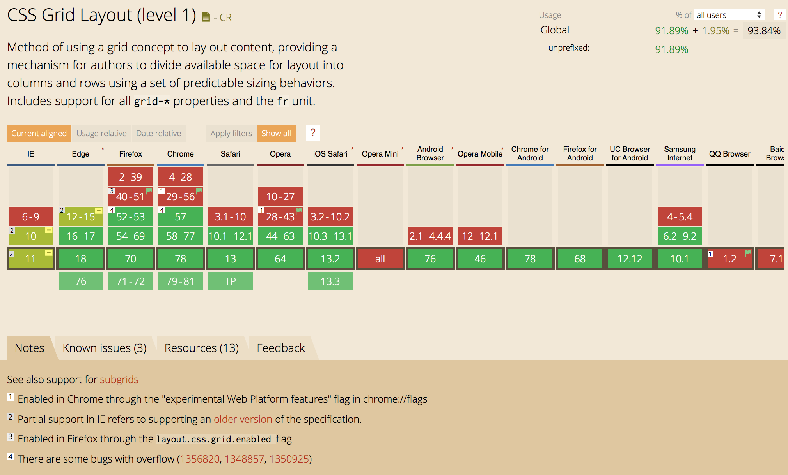
    <figcaption>&nbsp;&nbsp;&nbsp; Image - CSS Grid browser support </figcaption>
  </figure>
</p>

1.5. Important Terminology
---------------------

Let's learn some of the Important Terminology/concepts related to CSS Grid Layout to get proper understandings and how does it work. Here are the main terms or entities while dealing with CSS Grid:
- **`display:grid`** (CSS property/style which converts an HTML element to a grid container - *`display: grid or inline-grid`*)
1. **`Grid Container`** (Direct Parent/Container to hold sub-items, to the container we apply *` display: grid or inline-grid`* property)
2. **`Grid Items`** (Child/sub-items [direct descendants] within Container - All direct children of the `grid container` automatically become `grid items`)
3. **`Grid Column`** (The vertical series-part/portrait lines of the grid, table, chart or spreadsheet. CSS property is *`grid-template-columns`*)
4. **`Grid Row`** (The horizontal series-part/landscape lines of the grid, table, chart or spreadsheet. CSS property is *`grid-template-rows`*)
5. **`Grid Gaps`** (The spaces (margin or cell-spacing) between each column/row. CSS property is *`grid-column-gap` and `grid-row-gap`*)
6. **`Grid Line`** (The lines between columns/rows, the dividing lines that make up the structure of the grid. CSS property is *`grid-column-start`, `grid-column-end` and `grid-row-start`, `grid-row-end`*)
7. **`Grid Track`** (A grid track is a space between 2 adjacent grid lines, they are the rows and columns of your grid)
8. **`Grid Cell`** (A box/intersection point where the column and row get insects it creates a box/cell like a table cell, A grid cell is the space between 2 adjacent row grid lines and 2 adjacent column grid lines)
9. **`Grid Area`** (The total space surrounded by four grid lines, A grid area is made up of 1 or more grid cells, and is bound by 4 grid lines on each side of the grid area. CSS property is *grid-item = `grid-area`, grid-container = `grid-template-areas`*)
10. **`The fr Unit`** (The new `fr unit (fractional unit)` represents a fraction of the available space or free space available in the grid container. Simply available space is nothing but free space so you can also consider `fr` as `free space`. CSS property is *`grid-template-columns/rows: 1fr 1fr 1fr`*)
11. **`Explicit Column/Row`** Any Column or Row created as per needs and requirements with property `grid-template-columns` and `grid-template-rows` respectively (Explicit = Developer or User defines how many Columns or Rows required)  
12. **`Implicit Column/Row`** Auto-generated Column/Row. `grid-auto-columns` and `grid-auto-rows` property used to handle/control/size any auto-generated grid tracks ie. implicit grid (Implicit = Automatically generated Column/Row. [Total Grid Items are 10, we defined 2 columns and 2 Rows with `grid-template-columns` and `grid-template-rows` property, so 4 items are `Explicit` and rest 6 items are `Implicit`])


To start with CSS Grid just apply a property `display` type of `grid` to the parent container/Grid Container (grid container), so Grid Items/child items/elements automatically turn to the grid item.

> **Syntax & Example**: `1.5-grid-container-item.html basic markup`

```html
 <div class="main-container">
  <div class="item item-1">item-1</div>
  <div class="item item-2">item-2</div>
  <div class="item item-3">item-3</div>
  <div class="item item-4">item-4</div>
  <div class="item item-5">item-5</div>
  <div class="item item-6">item-6</div>
  <div class="item item-7">item-7</div>
  <div class="item item-8">item-8</div>
  <div class="item item-9">item-9</div>
</div>
```

<hr/>

> **Syntax & Example**: `1.5-grid-container-item.html default markup and output`

```html
<!DOCTYPE html>

<html lang="en">

  <head>
    <meta charset="UTF-8">
    <meta name="viewport" content="width=device-width, initial-scale=1.0">
    <meta http-equiv="X-UA-Compatible" content="ie=edge">
    <title>1.5-grid-container-item.html</title>

    <style type="text/css">

      body {
        margin: 0;
        padding: 0;
        font-family: verdana;
      }

      .main-container {
        border: 4px solid #826a98;
        margin: 0 auto;
      }

      .item {
        color: #ffffff;
        font-size: 1rem;
        padding: 0.75rem;
        text-align: center;
      }

      .main-container div:nth-child(odd) {
        background: #8FBC8E;
      }

      .main-container div:nth-child(even) {
        background: #734F96;
      }

    </style>

  </head>

  <body>

    <div class="main-container">
      <div class="item item-1">item-1</div>
      <div class="item item-2">item-2</div>
      <div class="item item-3">item-3</div>
      <div class="item item-4">item-4</div>
      <div class="item item-5">item-5</div>
      <div class="item item-6">item-6</div>
      <div class="item item-7">item-7</div>
      <div class="item item-8">item-8</div>
      <div class="item item-9">item-9</div>
    </div>
    
  </body>
  
</html>
```

<p>
  <figure>
    &nbsp;&nbsp;&nbsp; 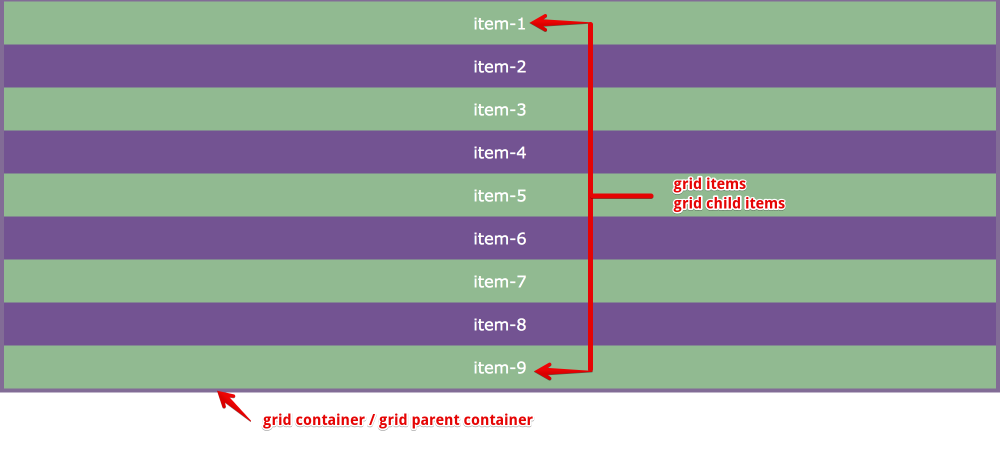
    <figcaption>&nbsp;&nbsp;&nbsp; Image - Grid parent container and grid child item markup </figcaption>
  </figure>
</p>

<hr/>

> **Syntax & Example**: `1.5-flex-container-item.html display:grid`

```html
<style type="text/css">
  .main-container {
    border: 4px solid #826a98;
    margin: 0 auto;

    display: grid; /* block level grid container */
    /* display: inline-grid; */ /* inline grid container */
  }
</style>
```

2 CSS Grid Container Properties 
===================== 

Let's look into some of the important properties used with Grid Container:
- **`display`**
  - It defines the Grid Container inline or block
  - An important and mandatory property to work with CSS Grid
- **`grid-template-columns`** 
  - Defines/specify grid track list for all the columns in the grid with *grid tracks* and *line names*
- **`grid-template-rows`**
  - Defines/specify grid track list for all the rows in the grid with *grid tracks* and *line names*
- **`grid-template-areas`**
  - Defines a grid template by referencing the names of the grid areas which are specified/named with the *grid-area* property for visualisation of the grid structure
- **`grid-template`**
  - Shorthand property for defining/setting a combination of *grid-template-columns*, *grid-template-rows* and *grid-template-areas*
- **`grid-column-gap`**
  - The spaces (margin or cell-spacing or gutter) between each column/row, it specifies the size of the grid lines
- **`grid-row-gap`**
  - The spaces (margin or cell-spacing or gutter) between each row/column, it specifies the size of the grid lines
- **`grid-gap`**
  - Shorthand property for setting *grid-row-gap* and *grid-column-gap* in a single declaration
- **`justify-items`**
  - Defines alignment of items along the main ie. inline (row) axis (horizontal)
- **`align-items`**
  - Defines how grid items layout/laid out with the cross ie. block (column) axis (vertical)
- **`place-items`**
  - place-items sets both the *align-items (columner or vertical)*  and *justify-items (row or horizontal)* properties in a single declaration
- **`justify-content`**
  - Defines alignment of items (distributes space between grid items) along the main axis (horizontal)
- **`align-content`**
  - Defines alignment of items (distributes space between grid items) along the cross axis (vertical)
- **`place-content`**
  - Shorthand CSS property for *align-content* and *justify-content* in a single declaration
- **`grid-auto-columns`**
  - Specifies the size of any auto-generated grid tracks ie. implicit grid tracks columns
- **`grid-auto-rows`**
  - Specifies the size of any auto-generated grid tracks ie. implicit grid tracks rows
- **`grid-auto-flow`**
  - Controls/adjust how the automatic placement of grid items work when they are not explicitly positioned with any grid-placement properties
- **`grid`**
  - Shorthand for setting properties like: *grid-template-rows*, *grid-template-columns*, *grid-template-areas*, *grid-auto-rows*, *grid-auto-columns*, and *grid-auto-flow* in a single declaration

2.1. Grid Display
---------------------

- To create a grid container, we set the value of the container's `display` property to `grid` or `inline-grid`
- It creates/builds a `grid formatting context` for its content. It only applies to direct child elements and does ***not extend*** to grandchild elements and beyond

`display` property creates either a `block-level` or `inline-level` grid container:
- **`display: grid`**;
  - block level grid, covers 100% width
- **`display: inline-grid`**;
  - inline-level, same line grid, covers only required width as per items width
- syntax:
```css 
.container {
  /* display: grid; */ /* block level grid container */
  /* display: inline-grid; */ /* inline grid container */

  display : grid | inline-grid; 
}
```

> **Syntax & Example**: `2.1-grid-display.html,  display: grid; /* block level grid container */`

```html
<!DOCTYPE html>

<html lang="en">

  <head>
    <meta charset="UTF-8">
    <meta name="viewport" content="width=device-width, initial-scale=1.0">
    <meta http-equiv="X-UA-Compatible" content="ie=edge">
    <title>2.1-grid-display</title>

    <style type="text/css">

      body {
        margin: 0;
        padding: 0;
        font-family: verdana;
      }

      .main-container {
        border: 4px solid #826a98;
        margin: 0 auto;

        display: grid; /* block level grid container */
        /* display: inline-grid; */ /* inline grid container */
      }

      .item {
        color: #ffffff;
        font-size: 1rem;
        padding: 0.75rem;
        text-align: center;
      }

      .main-container div:nth-child(odd) {
        background: #8FBC8E;
      }

      .main-container div:nth-child(even) {
        background: #734F96;
      }
    </style>

  </head>

  <body>

    <div class="main-container">
      <div class="item item-1">item-1</div>
      <div class="item item-2">item-2</div>
      <div class="item item-3">item-3</div>
      <div class="item item-4">item-4</div>
      <div class="item item-5">item-5</div>
      <div class="item item-6">item-6</div>
      <div class="item item-7">item-7</div>
      <div class="item item-8">item-8</div>
      <div class="item item-9">item-9</div>
      <!-- <div class="item item-10">item-10</div> -->
    </div>
    
  </body>
  
</html>
```

<p>
  <figure>
    &nbsp;&nbsp;&nbsp; 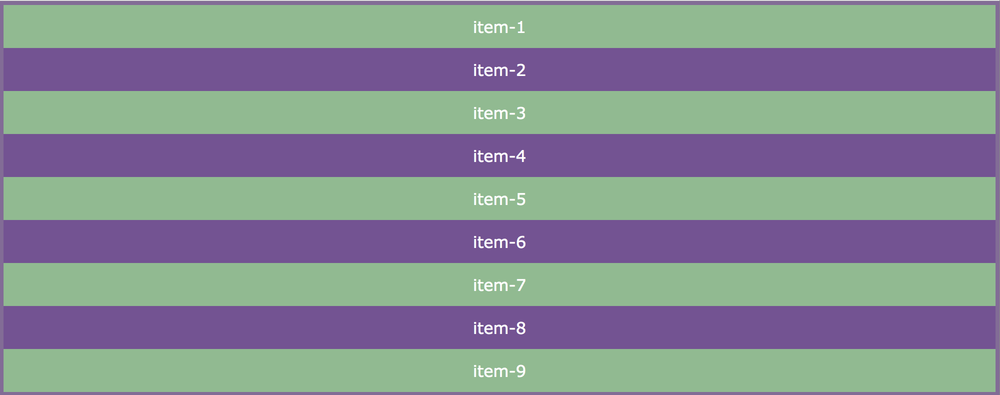
    <figcaption>&nbsp;&nbsp;&nbsp; Image - display: grid; </figcaption>
  </figure>
</p>

<hr/>

> **Syntax & Example**: `2.1-grid-display.html,  display: inline-grid; /* inline grid container */`

```css
.main-container {
  border: 4px solid #826a98;
  margin: 0 auto;

  /* display: grid; */ /* block level grid container */
  display: inline-grid; /* inline grid container */
}
```

<p>
  <figure>
    &nbsp;&nbsp;&nbsp; 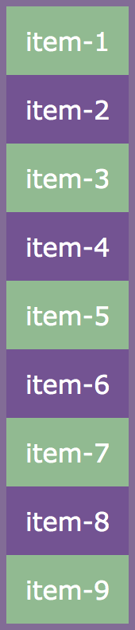
    <figcaption>&nbsp;&nbsp;&nbsp; Image - display: inline-grid; </figcaption>
  </figure>
</p>

2.2. Grid Template Columns
---------------------
2.2. grid-template-columns
---------------------

- The vertical series-part/portrait lines of the grid, table, chart or spreadsheet are known/called as `columns`. CSS property to create columns is *`grid-template-columns`*
- `grid-template-columns` property defines the columns of the grid with a space-separated list of values. The values represent the track size, and the space between them represents the grid line
- It simply defines/specify number of columns in grid layout (how many columns we want in the grid) with grid track list for all the columns in the grid with *grid tracks* and *line names*
- syntax:
```css 
.container {
  /*grid-template-columns: <track-size> | <line-name> <track-size>; */

  /* grid-template-columns: 150px 350px 480px; */ /* 3 columns in grid with different width - in pixel */
  /* grid-template-columns: 15% 35% 48%; */ /* width - in percentage */
  grid-template-columns: 150px 35% auto; /* width - in combination of pixel, percentage and auto/available space */
}
```

> **Syntax & Example**: `2.2-grid-template-columns-width-px-auto.html`

```html
<!DOCTYPE html>

<html lang="en">

  <head>
    <meta charset="UTF-8">
    <meta name="viewport" content="width=device-width, initial-scale=1.0">
    <meta http-equiv="X-UA-Compatible" content="ie=edge">
    <title>2.2-grid-template-columns-width-px-auto.html</title>

    <style type="text/css">

      body {
        margin: 0;
        padding: 0;
        font-family: verdana;
      }

      .main-container {
        border: 4px solid #826a98;
        width: 1000px;
        margin: 0 auto;

        display: grid; /* block level grid container */
        /* display: inline-grid; */ /* inline level grid container */

        /* grid-template-columns: 150px 350px 500px; */ /* 3 columns grid with different width - in pixel */
        /* grid-template-columns: 15% 35% 50%; */ /* width - in percentage */
        grid-template-columns: 150px 35% auto; /* width - in combination of pixel, percentage and auto */
      }

      .item {
        color: #ffffff;
        font-size: 1rem;
        padding: 0.75rem;
        text-align: center;
      }

      .main-container div:nth-child(odd) {
        background: #8FBC8E;
      }

      .main-container div:nth-child(even) {
        background: #734F96;
      }

    </style>

  </head>

  <body>

    <div class="main-container">
      <div class="item item-1">item-1</div>
      <div class="item item-2">item-2</div>
      <div class="item item-3">item-3</div>
      <div class="item item-4">item-4</div>
      <div class="item item-5">item-5</div>
      <div class="item item-6">item-6</div>
      <div class="item item-7">item-7</div>
      <div class="item item-8">item-8</div>
      <div class="item item-9">item-9</div>
      <!-- <div class="item item-10">item-10</div> -->
    </div>
    
  </body>
  
</html>
```

<p>
  <figure>
    &nbsp;&nbsp;&nbsp; 
    <figcaption>&nbsp;&nbsp;&nbsp; Image - grid-template-columns: 150px 350px 500px; /* 3 columns in grid with different width - in pixel */ </figcaption>
  </figure>
</p>

<hr/>

<p>
  <figure>
    &nbsp;&nbsp;&nbsp; 
    <figcaption>&nbsp;&nbsp;&nbsp; Image - grid-template-columns: 15% 35% 50%; /* width - in percentage */ </figcaption>
  </figure>
</p>

<hr/>

<p>
  <figure>
    &nbsp;&nbsp;&nbsp; 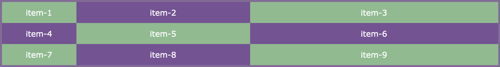
    <figcaption>&nbsp;&nbsp;&nbsp; Image - grid-template-columns: 150px 35% auto; /* width - in combination of pixel, percentage and auto */ </figcaption>
  </figure>
</p>

2.3. The fr Unit
---------------------
2.3. The fr fractional Unit
---------------------

- When sizing rows and columns, one can use different CSS lengths like px, % percentage, rem, auto (like 250px or 20%) and perhaps the most useful and important one is `fr` ie. the `fractional units`
- `fr` ie. the `fractional units` is a flexible length, declared using the `fr`, which takes up a share of the remaining free space in proportion to its flex factor 
- The new `fr Unit` represents a fraction of the available space in the grid container
- Example: Given a grid container of `1000px with 3 columns` of `200px, 2fr and 3fr` respectively. The flexibly sized columns will take up the remaining `800px` in the ratio of `2:3` (remaining 800px divided into 5 equal parts of 160px each), so the second column takes up 320px and the third column takes up 480px
- CSS property is *`grid-template-columns/rows: 1fr 1fr 1fr`*)
- syntax:
```css 
.container {
  /*grid-template-columns: <track-size> | <line-name> <track-size>; */

  grid-template-columns: 200px 2fr 3fr; /* fr/fraction = proportionate size/space ie. 200px 320px 48px */
  /* grid-template-columns: 1fr 200px; */ /* fr/fraction = proportionate size/space ie. 88px 200px */
}
```

> **Syntax & Example**: `2.3-grid-template-columns-width-fr-fraction-unit.html`

```html
<!DOCTYPE html>

<html lang="en">

  <head>
    <meta charset="UTF-8">
    <meta name="viewport" content="width=device-width, initial-scale=1.0">
    <meta http-equiv="X-UA-Compatible" content="ie=edge">
    <title>2.3-grid-template-columns-width-fr-fraction-unit.html</title>

    <style type="text/css">

      body {
        margin: 0;
        padding: 0;
        font-family: verdana;
      }

      .main-container {
        border: 4px solid #826a98;
        width: 1000px;
        margin: 0 auto;

        display: grid; /* block level grid container */
        /* display: inline-grid; */ /* inline level grid container */

        grid-template-columns: 200px 2fr 3fr; /* fr/fraction = proportionate size/space ie. 200px 320px 48px */
        /* grid-template-columns: 1fr 200px; */ /* fr/fraction = proportionate size/space ie. 800px 200px */
      }

      .item {
        color: #ffffff;
        font-size: 1rem;
        padding: 0.75rem;
        text-align: center;
      }

      .main-container div:nth-child(odd) {
        background: #8FBC8E;
      }

      .main-container div:nth-child(even) {
        background: #734F96;
      }
    
    </style>

  </head>

  <body>

    <div class="main-container">
      <div class="item item-1">item-1</div>
      <div class="item item-2">item-2</div>
      <div class="item item-3">item-3</div>
      <div class="item item-4">item-4</div>
      <div class="item item-5">item-5</div>
      <div class="item item-6">item-6</div>
      <div class="item item-7">item-7</div>
      <div class="item item-8">item-8</div>
      <div class="item item-9">item-9</div>
      <!-- <div class="item item-10">item-10</div> -->
    </div>
    
  </body>
  
</html>
```

<p>
  <figure>
    &nbsp;&nbsp;&nbsp; 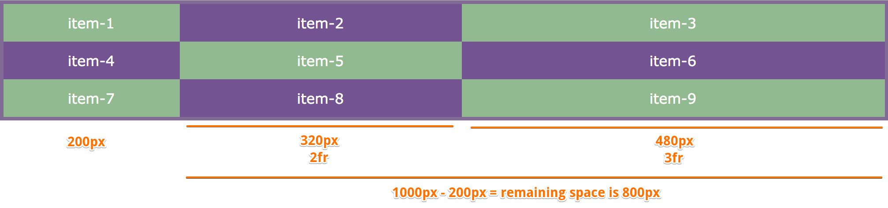
    <figcaption>&nbsp;&nbsp;&nbsp; Image - grid-template-columns: 200px 2fr 3fr; /* fr/fraction = proportionate size/space ie. 200px 320px 48px */ </figcaption>
  </figure>
</p>

<hr/>

<p>
  <figure>
    &nbsp;&nbsp;&nbsp; 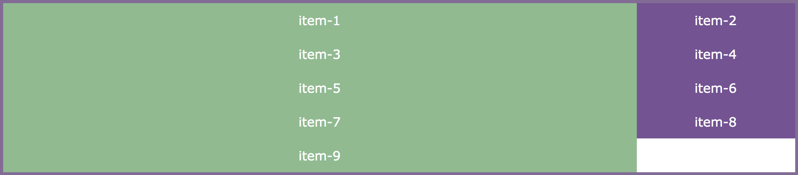
    <figcaption>&nbsp;&nbsp;&nbsp; Image - grid-template-columns: 1fr 200px; /* fr/fraction = proportionate size/space ie. 800px 200px */ </figcaption>
  </figure>
</p>

2.4. The repeat function
---------------------
2.4. The repeat() function
---------------------

- The `repeat() function` allows us to repeat/iterate something (columns or rows) n number of times
- We can use the `repeat() notation` to define repeating parts while declaring columns or rows and save some typing
- CSS property is *`grid-template-columns/rows: repeat(2, 1fr)`*)
- syntax:
```css 
.container {
  /*grid-template-columns: <track-size> | <line-name> <track-size>; */

  grid-template-columns: repeat(2, 1fr); /* 2 columns of 1fr each of equal width */
}
```

> **Syntax & Example**: `2.4.1-grid-template-columns-repeat.html`

```html
<!DOCTYPE html>

<html lang="en">

  <head>
    <meta charset="UTF-8">
    <meta name="viewport" content="width=device-width, initial-scale=1.0">
    <meta http-equiv="X-UA-Compatible" content="ie=edge">
    <title>2.4.1-grid-template-columns-repeat.html</title>

    <style type="text/css">

      body {
        margin: 0;
        padding: 0;
        font-family: verdana;
      }

      .main-container {
        border: 4px solid #826a98;
        width: 1000px;
        margin: 0 auto;

        display: grid; /* block level grid container */
       /* display: inline-grid; */ /* inline level grid container */

        grid-template-columns: repeat(2, 1fr); /* 2 columns of 1fr each of equal width */
      }

      .item {
        color: #ffffff;
        font-size: 1rem;
        padding: 0.75rem;
        text-align: center;
      }

      .main-container div:nth-child(odd) {
        background: #8FBC8E;
      }

      .main-container div:nth-child(even) {
        background: #734F96;
      }

    </style>

  </head>

  <body>

    <div class="main-container">
      <div class="item item-1">item-1</div>
      <div class="item item-2">item-2</div>
      <div class="item item-3">item-3</div>
      <div class="item item-4">item-4</div>
      <div class="item item-5">item-5</div>
      <div class="item item-6">item-6</div>
      <div class="item item-7">item-7</div>
      <div class="item item-8">item-8</div>
      <div class="item item-9">item-9</div>
      <div class="item item-10">item-10</div>
    </div>
    
  </body>
  
</html>
```

<p>
  <figure>
    &nbsp;&nbsp;&nbsp; 
    <figcaption>&nbsp;&nbsp;&nbsp; Image - grid-template-columns: repeat(2, 1fr); /* 2 columns of 1fr each of equal width */ </figcaption>
  </figure>
</p>

<hr/>

> **Syntax & Example**: `2.4.2-grid-template-columns-repeat.html`

```html
<!DOCTYPE html>

<html lang="en">

  <head>
    <meta charset="UTF-8">
    <meta name="viewport" content="width=device-width, initial-scale=1.0">
    <meta http-equiv="X-UA-Compatible" content="ie=edge">
    <title>2.4.2-grid-template-columns-repeat.html</title>

    <style type="text/css">

      body {
        margin: 0;
        padding: 0;
        font-family: verdana;
      }

      .main-container {
        border: 4px solid #826a98;
        width: 1000px;
        margin: 0 auto;

        display: grid; /* block level grid container */
        /* display: inline-grid; */ /* inline level grid container */
 
        grid-template-columns: repeat(1, 1fr 2fr 1fr); /* repeate 3 columns 1 time and create 3 columns of different width */

        /* grid-template-columns: repeat(6, 1fr 2fr); */ /* repeate 2 columns 6 times = create 12 columns of different width */
      }

      .item {
        color: #ffffff;
        font-size: 1rem;
        padding: 0.75rem;
        text-align: center;
      }

      .main-container div:nth-child(odd) {
        background: #8FBC8E;
      }

      .main-container div:nth-child(even) {
        background: #734F96;
      }

    </style>

  </head>

  <body>

    <div class="main-container">
      <div class="item item-1">item-1</div>
      <div class="item item-2">item-2</div>
      <div class="item item-3">item-3</div>
      <div class="item item-4">item-4</div>
      <div class="item item-5">item-5</div>
      <div class="item item-6">item-6</div>
      <div class="item item-7">item-7</div>
      <div class="item item-8">item-8</div>
      <div class="item item-9">item-9</div>
      <div class="item item-10">item-10</div>
      <div class="item item-11">item-11</div>
      <div class="item item-12">item-12</div>
    </div>
    
  </body>
  
</html>
```

<p>
  <figure>
    &nbsp;&nbsp;&nbsp; 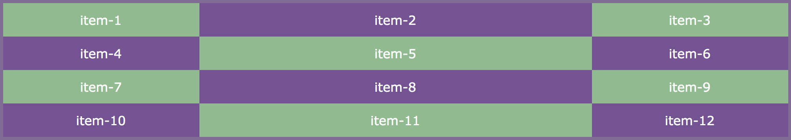
    <figcaption>&nbsp;&nbsp;&nbsp; Image - grid-template-columns: repeat(1, 1fr 2fr 1fr); /* repeate 3 columns 1 time and create 3 columns of different width */</figcaption>
  </figure>
</p>

<hr/>

<p>
  <figure>
    &nbsp;&nbsp;&nbsp; 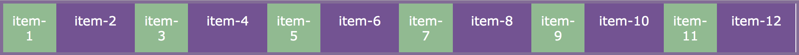
    <figcaption>&nbsp;&nbsp;&nbsp; Image - grid-template-columns: repeat(6, 1fr 2fr); /* repeate 2 columns 6 times = create 12 columns of different width */ </figcaption>
  </figure>
</p>

2.5. Grid Template Rows
---------------------
2.5. grid-template-rows
---------------------

- The horizontal series-part/landscape lines of the grid, table, chart or spreadsheet are known/called as `rows`. CSS property to create rows is *`grid-template-rows`*
- `grid-template-rows` property defines the rows of the grid with a space-separated list of values. The values represent the track size (height), and the space between them represents the grid line
- It simply defines/specifies the height of each row present in grid layout container ie. `explicit grid tracks rows`
- Grid rows are calculated and created automatically (as it depends on two things: the number of columns defined and the total number of grid items ie. content present)
- Row height is fully dependent on text matter/content available inside the grid item. By default min-height of a row is equivalent to the height of text contents
- `grid-auto-rows` property helps to define/specify and set the height of all rows inside grid container (Specifies the size of any auto-generated grid tracks ie. `implicit grid tracks rows`)
- `minmax(minHight, maxHight)` function is also used to set default minimum default height and specify maximum height if content expanded/enlarged. example: `minmax(50px, auto)`
- syntax:
```css 
.container {
  /*grid-template-rows: <track-size> | <line-name> <track-size>; */

  grid-template-rows: 100px 300px 100px; /* defines the height of each row - in pixel */
  /* grid-template-rows: 20% 60% 20%; */ /* height of each row - in percentage */
  /* grid-template-rows: auto auto auto; */ /* height of each row - in combination of pixel, percentage and auto */
  /* grid-template-rows: 1fr 2fr 1fr; */ /* height of each row - in fr fractional unit */
}
```

> **Syntax & Example**: `2.5.1-grid-template-rows-height-px-auto-fr-fraction-unit.html`

```html
<!DOCTYPE html>

<html lang="en">

  <head>
    <meta charset="UTF-8">
    <meta name="viewport" content="width=device-width, initial-scale=1.0">
    <meta http-equiv="X-UA-Compatible" content="ie=edge">
    <title>2.5.1-grid-template-rows-px-auto.html</title>

    <style type="text/css">

      body {
        margin: 0;
        padding: 0;
        font-family: verdana;
      }

      .main-container {
        border: 4px solid #826a98;
        width: 1000px;
        margin: 0 auto;

        height: 500px;

        display: grid; /* block level grid container */
        /* display: inline-grid; */ /* inline level grid container */

        grid-template-columns: 150px 35% auto;

        grid-template-rows: 100px 300px 100px; /* defines the height of each row - in pixel */
        /* grid-template-rows: 20% 60% 20%; */ /* height of each row - in percentage */
        /* grid-template-rows: auto auto auto; */ /* height of each row - in combination of pixel, percentage and auto */
        /* grid-template-rows: 1fr 2fr 1fr; */ /* height of each row - in fr fractional unit */
      }

      .item {
        color: #000;
        font-size: 1rem;
        padding: 0.75rem;
        text-align: center;
      }

      .main-container div:nth-child(odd) {
        background: #8FBC8E;
      }

      .main-container div:nth-child(even) {
        background: #734F96;
      }

    </style>

  </head>

  <body>

    <div class="main-container">
      <div class="item item-1">item-1: Row height is by default depends on content</div>
      <div class="item item-2">item-2</div>
      <div class="item item-3">item-3</div>
      <div class="item item-4">item-4</div>
      <div class="item item-5">item-5</div>
      <div class="item item-6">item-6: Row height is by default depends on content 1 , Row height is by default depends on content 2 , Row height is by default depends on content 3, Row height is by default depends on content 4 , Row height is by default depends on content 5 , Row height is by default depends on content 6 , Row height is by default depends on content 7, Row height is by default depends on content 8</div>
      <div class="item item-7">item-7</div>
      <div class="item item-8">item-8: Row height is by default depends on content 1 , Row height is by default depends on content 2 , Row height is by default depends on content 3, Row height is by default depends on content 4 </div>
      <div class="item item-9">item-9</div>
      <!-- <div class="item item-10">item-10</div> -->
    </div>
    
  </body>
  
</html>
```

<p>
  <figure>
    &nbsp;&nbsp;&nbsp; 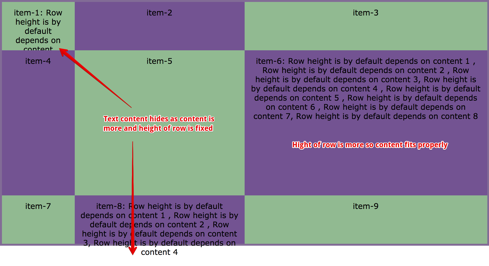
    <figcaption>&nbsp;&nbsp;&nbsp; Image - grid-template-rows: 100px 300px 100px; /* defines the height of each row - in pixel */ </figcaption>
  </figure>
</p>

<hr/>

<p>
  <figure>
    &nbsp;&nbsp;&nbsp; 
    <figcaption>&nbsp;&nbsp;&nbsp; Image - /* grid-template-rows: 20% 60% 20%; */ /* height of each row - in percentage */ </figcaption>
  </figure>
</p>

<hr/>

<p>
  <figure>
    &nbsp;&nbsp;&nbsp; 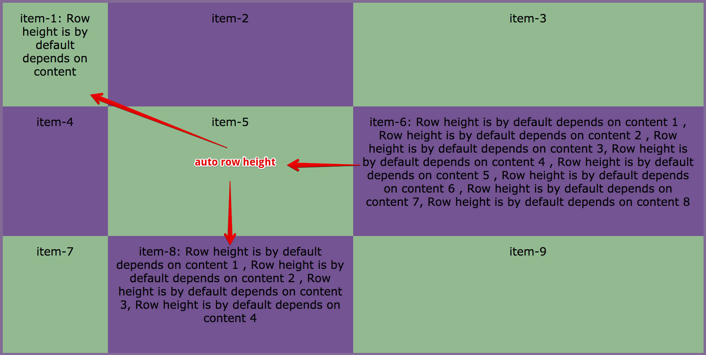
    <figcaption>&nbsp;&nbsp;&nbsp; Image - /* grid-template-rows: auto auto auto; */ /* height of each row - in combination of pixel, percentage and auto */ </figcaption>
  </figure>
</p>

<hr/>

<p>
  <figure>
    &nbsp;&nbsp;&nbsp; 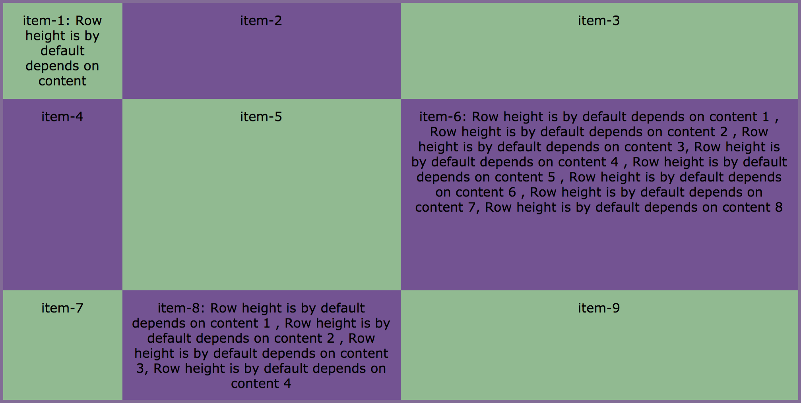
    <figcaption>&nbsp;&nbsp;&nbsp; Image - /* grid-template-rows: 1fr 2fr 1fr; */ /* height of each row - in fr fractional unit */ </figcaption>
  </figure>
</p>

<hr/>

> **Syntax & Example**: `2.5.2-grid-template-rows-height-minmax.html`

```html
<!DOCTYPE html>

<html lang="en">

  <head>
    <meta charset="UTF-8">
    <meta name="viewport" content="width=device-width, initial-scale=1.0">
    <meta http-equiv="X-UA-Compatible" content="ie=edge">
    <title>2.5.2-grid-template-rows-height-minmax.html</title>

    <style type="text/css">

      body {
        margin: 0;
        padding: 0;
        font-family: verdana;
      }

      .main-container {
        border: 4px solid #826a98;
        width: 1000px;
        margin: 0 auto;

        display: grid; /* block level grid container */
        /* display: inline-grid; */ /* inline level grid container */

        grid-template-columns: 150px 35% auto;
        grid-template-rows: repeat(3, minmax(50px, auto)); /* repeat the rows with minimum height of 50px and maximum auto */
      }

      .item {
        color: #000;
        font-size: 1rem;
        padding: 0.75rem;
        text-align: center;
      }

      .main-container div:nth-child(odd) {
        background: #8FBC8E;
      }

      .main-container div:nth-child(even) {
        background: #734F96;
      }

    </style>

  </head>

  <body>

    <div class="main-container">
      <div class="item item-1">item-1</div>
      <div class="item item-2">item-2</div>
      <div class="item item-3">item-3</div>
      <div class="item item-4">item-4</div>
      <div class="item item-5">item-5</div>
      <div class="item item-6">item-6: Row height is by default depends on content 1 , Row height is by default depends on content 2 , Row height is by default depends on content 3, Row height is by default depends on content 4 , Row height is by default depends on content 5 , Row height is by default depends on content 6 , Row height is by default depends on content 7, Row height is by default depends on content 8</div>
      <div class="item item-7">item-7</div>
      <div class="item item-8">item-8</div>
      <div class="item item-9">item-9</div>
      <!-- <div class="item item-10">item-10</div> -->
    </div>
    
  </body>
  
</html>
```

<p>
  <figure>
    &nbsp;&nbsp;&nbsp; 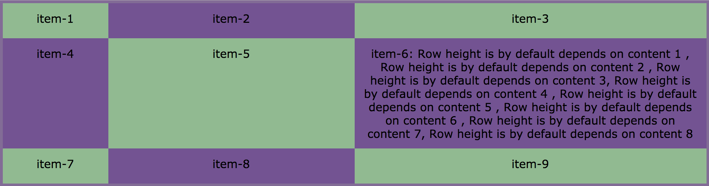
    <figcaption>&nbsp;&nbsp;&nbsp; Image - grid-template-rows: repeat(3, minmax(50px, auto)); /* repeat the rows with minimum height of 50px and maximum auto */ </figcaption>
  </figure>
</p>

2.6. Grid Column Gap
---------------------

- The spaces (margin or cell-spacing or gutter) between each column, it specifies the size of the grid lines. We can think of it like setting the width of the gutters/margin/spacing between the columns
> **Note**: When we apply Margin to grid item/child it by default applies to all sides as well as outside of grid item/child so eventually to grid container - to avoid this unwanted gaps we must use and apply `grid-column-gap or grid-row-gap or grid-gap` property
- syntax:
```css
.container {
  grid-column-gap: <line-size>;

  grid-column-gap: 10px;
}
```

> **Syntax & Example**: `2.6-grid-column-gap.html`

```html
<!DOCTYPE html>

<html lang="en">

  <head>
    <meta charset="UTF-8">
    <meta name="viewport" content="width=device-width, initial-scale=1.0">
    <meta http-equiv="X-UA-Compatible" content="ie=edge">
    <title>2.6-grid-column-gap.html</title>

    <style type="text/css">

      body {
        margin: 0;
        padding: 0;
        font-family: verdana;
      }

      .main-container {
        border: 4px solid #826a98;
        width: 1000px;
        margin: 0 auto;

        display: grid; /* block level grid container */
       /* display: inline-grid; */ /* inline level grid container */

        grid-column-gap: 10px;
        /* grid-row-gap: 10px; */
        /* grid-gap: 10px; */

        grid-template-columns: 150px 35% auto; /* width - in combination of pixel, percentage and auto */
      }

      .item {
        color: #ffffff;
        font-size: 1rem;
        padding: 0.75rem;
        text-align: center;
      }

      .main-container div:nth-child(odd) {
        background: #8FBC8E;
      }

      .main-container div:nth-child(even) {
        background: #734F96;
      }

    </style>

  </head>

  <body>

    <div class="main-container">
      <div class="item item-1">item-1</div>
      <div class="item item-2">item-2</div>
      <div class="item item-3">item-3</div>
      <div class="item item-4">item-4</div>
      <div class="item item-5">item-5</div>
      <div class="item item-6">item-6</div>
      <div class="item item-7">item-7</div>
      <div class="item item-8">item-8</div>
      <div class="item item-9">item-9</div>
      <!-- <div class="item item-10">item-10</div> -->
    </div>
    
  </body>
  
</html>
```

<p>
  <figure>
    &nbsp;&nbsp;&nbsp; 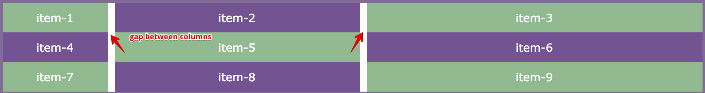
    <figcaption>&nbsp;&nbsp;&nbsp; Image - grid-column-gap: 10px; </figcaption>
  </figure>
</p>

2.7. Grid Row Gap
---------------------

- The spaces (margin or cell-spacing or gutter) between each row, it specifies the size of the grid lines. We can think of it like setting the width of the gutters/margin/spacing between the rows
- syntax:
```css
.container {
  grid-row-gap: <line-size>;

  grid-row-gap: 10px;
}
```

> **Syntax & Example**: `2.7-grid-row-gap.html`

```html
<!DOCTYPE html>

<html lang="en">

  <head>
    <meta charset="UTF-8">
    <meta name="viewport" content="width=device-width, initial-scale=1.0">
    <meta http-equiv="X-UA-Compatible" content="ie=edge">
    <title>2.7-grid-row-gap</title>

    <style type="text/css">

      body {
        margin: 0;
        padding: 0;
        font-family: verdana;
      }

      .main-container {
        border: 4px solid #826a98;
        width: 1000px;
        margin: 0 auto;

        display: grid; /* block level grid container */
       /* display: inline-grid; */ /* inline level grid container */

        /* grid-column-gap: 10px; */
        grid-row-gap: 10px;
        /* grid-gap: 10px; */

        grid-template-columns: 150px 35% auto; /* width - in combination of pixel, percentage and auto */

        grid-template-rows: 100px 70px 100px; /* row height in pixel */
      }

      .item {
        color: #ffffff;
        font-size: 1rem;
        padding: 0.75rem;
        text-align: center;
      }

      .main-container div:nth-child(odd) {
        background: #8FBC8E;
      }

      .main-container div:nth-child(even) {
        background: #734F96;
      }

    </style>

  </head>

  <body>

    <div class="main-container">
      <div class="item item-1">item-1</div>
      <div class="item item-2">item-2</div>
      <div class="item item-3">item-3</div>
      <div class="item item-4">item-4</div>
      <div class="item item-5">item-5</div>
      <div class="item item-6">item-6</div>
      <div class="item item-7">item-7</div>
      <div class="item item-8">item-8</div>
      <div class="item item-9">item-9</div>
      <!-- <div class="item item-10">item-10</div> -->
    </div>
    
  </body>
  
</html>
```

<p>
  <figure>
    &nbsp;&nbsp;&nbsp; 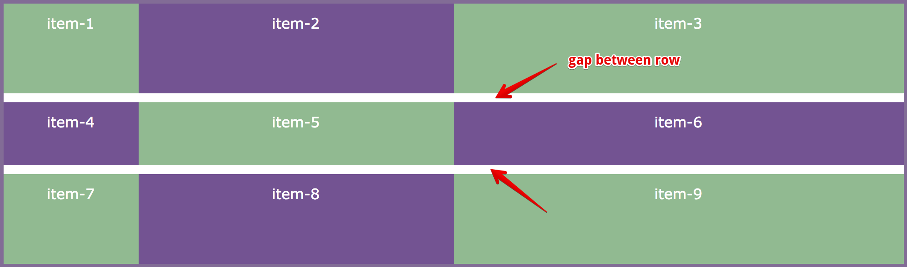
    <figcaption>&nbsp;&nbsp;&nbsp; Image - grid-row-gap: 10px; </figcaption>
  </figure>
</p>

2.8. Grid Gap
---------------------

- A shorthand property for setting *grid-row-gap* and *grid-column-gap* in a single declaration. We can think of it like setting the width of the gutters/margin/spacing between the columns/rows
- syntax:
```css
.container {
  grid-gap: <grid-row-gap> <grid-column-gap>;

  /* grid-column-gap: 10px;
  grid-row-gap: 10px; */

  /* grid-gap: 20px; */ /* single value for both row as well column gap */
  grid-gap: 20px 10px;
}
```

> **Syntax & Example**: `2.8-grid-gap.html`

```html
<!DOCTYPE html>

<html lang="en">

  <head>
    <meta charset="UTF-8">
    <meta name="viewport" content="width=device-width, initial-scale=1.0">
    <meta http-equiv="X-UA-Compatible" content="ie=edge">
    <title>2.8-grid-gap.html</title>

    <style type="text/css">

      body {
        margin: 0;
        padding: 0;
        font-family: verdana;
      }

      .main-container {
        border: 4px solid #826a98;
        width: 1000px;
        margin: 0 auto;

        display: grid; /* block level grid container */
       /* display: inline-grid; */ /* inline level grid container */

        grid-column-gap: 10px;
        /* grid-row-gap: 10px; */

        /* grid-gap: 20px; */ /* single value for both row as well column gap */
        grid-gap: 20px 10px;

        grid-template-columns: 150px 35% auto; /* width - in combination of pixel, percentage and auto */

        grid-template-rows: 100px 70px 100px; /* row height in pixel */
      }

      .item {
        color: #ffffff;
        font-size: 1rem;
        padding: 0.75rem;
        text-align: center;
      }

      .main-container div:nth-child(odd) {
        background: #8FBC8E;
      }

      .main-container div:nth-child(even) {
        background: #734F96;
      }

    </style>

  </head>

  <body>

    <div class="main-container">
      <div class="item item-1">item-1</div>
      <div class="item item-2">item-2</div>
      <div class="item item-3">item-3</div>
      <div class="item item-4">item-4</div>
      <div class="item item-5">item-5</div>
      <div class="item item-6">item-6</div>
      <div class="item item-7">item-7</div>
      <div class="item item-8">item-8</div>
      <div class="item item-9">item-9</div>
      <!-- <div class="item item-10">item-10</div> -->
    </div>
    
  </body>
  
</html>

```

<p>
  <figure>
    &nbsp;&nbsp;&nbsp; 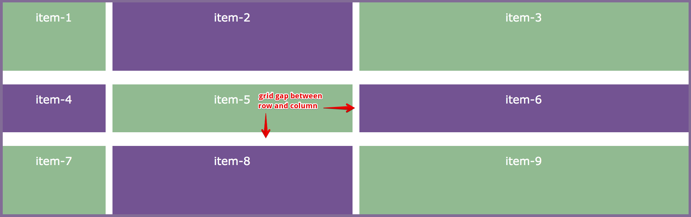
    <figcaption>&nbsp;&nbsp;&nbsp; Image - /* grid-gap: 20px; */ /* single value for both row as well column gap */
        grid-gap: 20px 10px; </figcaption>
  </figure>
</p>

2.9. Grid Template Areas
---------------------

- Defines a grid template by referencing the names of the grid areas which are specified/named with the *`grid-area`* property for visualisation of the grid structure
- This property defines `named grid areas` and provides a visualisation of the grid structure, which may help and significantly make underlying code easier to understand
- Repeating the name of a grid area causes the content to span those cells. A period signifies an empty cell
- syntax:
```css
.container {
  
  grid-template-areas: 
    "<grid-area-name> | . | none | ..."
    "...";
  
  - <grid-area-name> - the name of a grid area specified with grid-area
  - . - a period signifies an empty grid cell
  - none - no grid areas are defined
}
```

> **Syntax & Example**: `2.9.1-grid-template-area-web-layout.html`

```html
<!DOCTYPE html>

<html lang="en">

  <head>
    <meta charset="UTF-8">
    <meta name="viewport" content="width=device-width, initial-scale=1.0">
    <meta http-equiv="X-UA-Compatible" content="ie=edge">
    <title>2.9.1-grid-template-area-web-layout.html</title>

    <style type="text/css">

      body {
        margin: 0;
        padding: 0;
        font-family: verdana;

        color: #ffffff;
        font-size: 1rem;
        text-align: center;
      }

      .main-container {
        width: 980px;
        margin: 0 auto;
      
        display: grid; /* block level grid container */
        grid-template-columns: repeat(4, 1fr);
        grid-template-rows: auto;
        grid-gap: 20px;
        
        grid-template-areas: 
          "headerArea headerArea headerArea headerArea"
          "mainArea mainArea asideArea asideArea"
          "mainArea mainArea navArea navArea"
          "sectionArea sectionArea sectionArea sectionArea"
          "footerArea footerArea footerArea footerArea";
      }

      .main-container > * {
        background-color: #00bcd4;
        padding: 20px;
      }

      .header-section {
        grid-area: headerArea;
        background-color: #0199ad;
      }

      .main-section {
        grid-area: mainArea;
      }

      .section {
        grid-area: sectionArea;
      }

      .aside-section {
        grid-area: asideArea;
      }

      .nav-section {
        grid-area: navArea;
      }

      .footer-section {
        grid-area: footerArea;
        background-color: #0199ad;
      }
    </style>

  </head>

  <body>

    <div class="main-container">
      <header class="header-section"><h1>Header Section</h1></header>
      <main class="main-section">Main Section</main>
      <section class="section">Section Section</section>
      <aside class="aside-section">Aside Section</aside>
      <nav class="nav-section">Nav Section</nav>
      <footer class="footer-section"><small>Footer Section</small></footer>
    </div>
    
  </body>
  
</html>
```

<p>
  <figure>
    &nbsp;&nbsp;&nbsp; 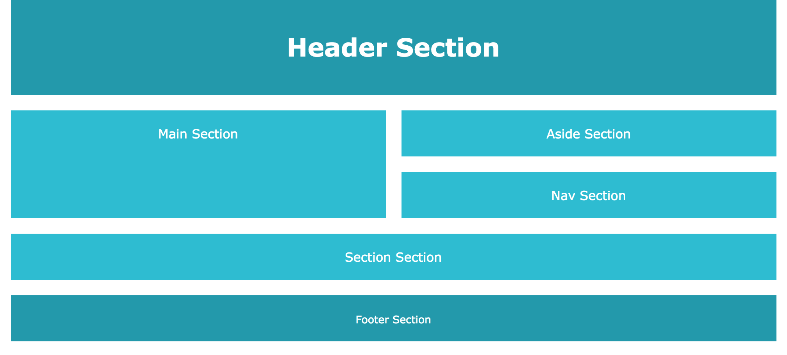
    <figcaption>&nbsp;&nbsp;&nbsp; Image - grid-template-areas and grid-area </figcaption>
  </figure>
</p>

<hr/>

> **Syntax & Example**: `2.9.2-grid-template-area-web-layout.html`

```css
.main-container {
  width: 980px;
  margin: 0 auto;

  display: grid; /* block level grid container */
  grid-template-columns: repeat(4, 1fr);
  grid-auto-rows: minmax(80px, auto);
  grid-gap: 20px;
  
  grid-template-areas: 
    "headerArea headerArea headerArea headerArea"
    "asideArea asideArea mainArea mainArea "
    "navArea navArea mainArea mainArea "
    "sectionArea sectionArea sectionArea sectionArea"
    "sectionArea sectionArea sectionArea sectionArea"
    "footerArea footerArea footerArea footerArea";
}
```

<p>
  <figure>
    &nbsp;&nbsp;&nbsp; 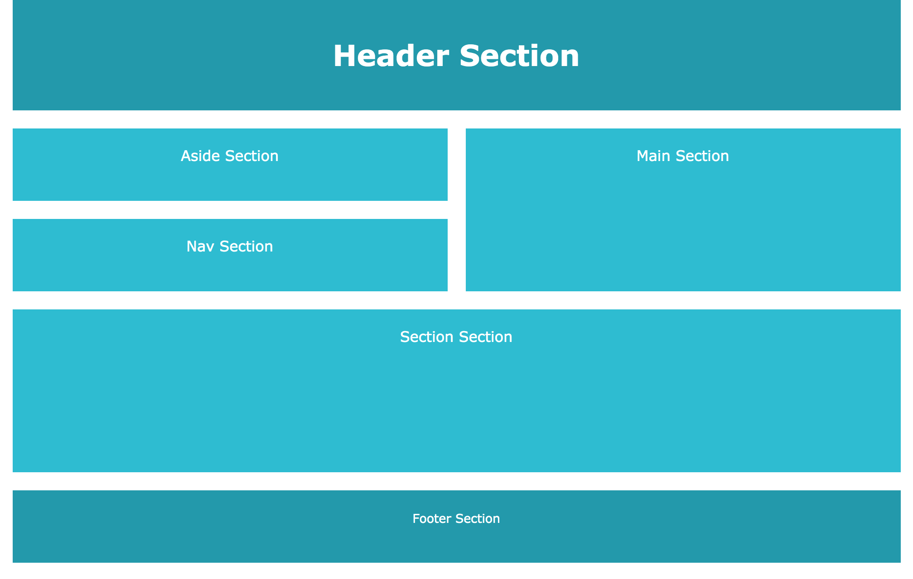
    <figcaption>&nbsp;&nbsp;&nbsp; Image - grid-template-areas and grid-area </figcaption>
  </figure>
</p>

<hr/>

> **Syntax & Example**: `2.9.3-grid-template-area-web-layout-empty-cell-area.html`

```css
.main-container {
  width: 980px;
  margin: 0 auto;

  display: grid; /* block level grid container */
  grid-template-columns: repeat(4, 1fr);
  grid-auto-rows: minmax(80px, auto);
  grid-gap: 20px;
  
  grid-template-areas: 
    "headerArea headerArea headerArea headerArea"
    "asideArea . mainArea mainArea "
    ". . mainArea mainArea "
    "navArea . sectionArea sectionArea"
    ". . sectionArea sectionArea"
    "footerArea footerArea footerArea footerArea";
}
```

<p>
  <figure>
    &nbsp;&nbsp;&nbsp; 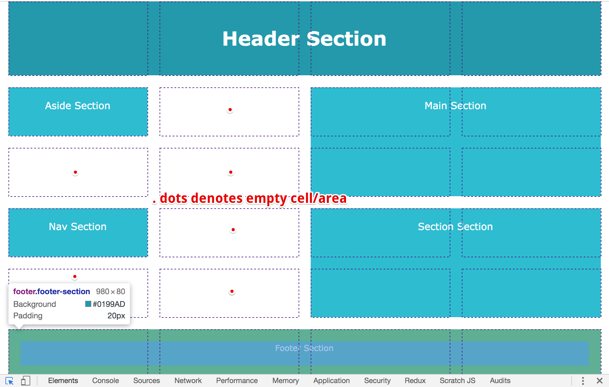
    <figcaption>&nbsp;&nbsp;&nbsp; Image - grid-template-areas and grid-area with dot (an empty cell/area)  </figcaption>
  </figure>
</p>

<hr/>

<p>
  <figure>
    &nbsp;&nbsp;&nbsp; 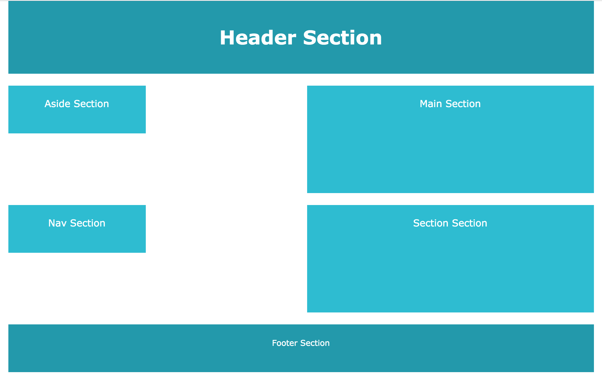
    <figcaption>&nbsp;&nbsp;&nbsp; Image - grid-template-areas and grid-area with dot (an empty cell/area)  </figcaption>
  </figure>
</p>

2.10. Grid Template
---------------------

- A shorthand property for defining/setting a combination of *grid-template-columns*, *grid-template-rows* and *grid-template-areas
- `grid-template` property is a shorthand for setting properties like `grid-template-rows`, `grid-template-columns`, and `grid-template-areas` in a single declaration
- syntax:
```css
.container {
  
  grid-template: none | <grid-template-rows> / <grid-template-columns> | <grid-template-areas>;
  
  - none - sets all three properties to their initial values
}
```

2.11. Nested Grid
---------------------

> **Syntax & Example**: `2.11-nested-grid-template.html`

```html
<!DOCTYPE html>

<html lang="en">

  <head>
    <meta charset="UTF-8">
    <meta name="viewport" content="width=device-width, initial-scale=1.0">
    <meta http-equiv="X-UA-Compatible" content="ie=edge">
    <title>2.11-nested-grid-template.html</title>

    <style type="text/css">

      body {
        margin: 0;
        padding: 0;
        font-family: verdana;

        color: #000000;
        font-size: 1rem;
        text-align: center;
      }

      .main-container {
        width: 980px;
        margin: 0 auto;
      
        display: grid; /* block level grid container */
        grid-template-columns: repeat(4, 1fr);
        grid-template-rows: auto;
        grid-gap: 20px;
        
        grid-template-areas: 
          "headerArea headerArea headerArea headerArea"
          "mainArea mainArea asideArea asideArea"
          "mainArea mainArea navArea navArea"
          "sectionArea sectionArea sectionArea sectionArea"
          "footerArea footerArea footerArea footerArea";
      }

      .main-container > * {
        background-color: #e6ba6c;
        padding: 20px;
      }

      .header-section {
        grid-area: headerArea;
        background-color: #bd7b04;
      }

      .main-section {
        grid-area: mainArea;
      }

      .section {
        grid-area: sectionArea;
      }

      .aside-section {
        grid-area: asideArea;
      }

      .nav-section {
        grid-area: navArea;
      }

      .footer-section {
        grid-area: footerArea;
        background-color: #bd7b04;
      }

      .nested-grid-container {
        margin-top: 20px;
        display: grid;
        grid-template-columns: 1fr 1fr 1fr 1fr;
        grid-template-rows: 150px;
        grid-gap:10px;
      }

      .nested-grid-container article{
        background-color: #bb8b34;
        padding:10px;
      }

    </style>

  </head>

  <body>

    <div class="main-container">
      <header class="header-section"><h1>Header Section</h1></header>
      
      <main class="main-section">
        <strong>Main Section with Nested Sub Section</strong>

        <section class="nested-grid-container">
          <article class="article1">Article 1</article>
          <article class="article2">Article 2</article>
          <article class="article3">Article 3</article>
          <article class="article4">Article 4</article>
        </section>

      </main>

      <section class="section">Section Section</section>
      <aside class="aside-section">Aside Section</aside>
      <nav class="nav-section">Nav Section</nav>
      <footer class="footer-section"><small>Footer Section</small></footer>
    </div>
    
  </body>
  
</html>
```

<p>
  <figure>
    &nbsp;&nbsp;&nbsp; 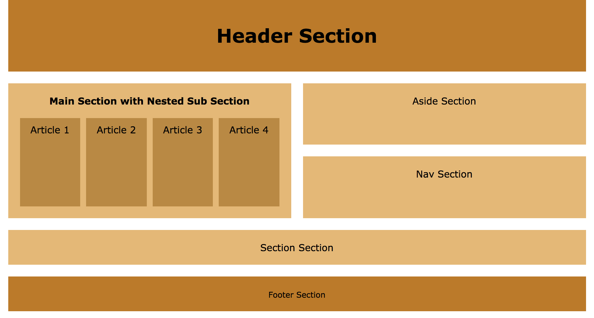
    <figcaption>&nbsp;&nbsp;&nbsp; Image - Netsted grid template web layout </figcaption>
  </figure>
</p>

<hr/>

```css
.nested-grid-container {
  margin-top: 20px;
  display: grid;
  /*  grid-template-columns: 1fr 1fr 1fr 1fr;
  grid-template-rows: 150px; */
  grid-gap:10px;

  /* */
  grid-template-columns: 1fr 1fr;
  grid-template-rows: auto 150px;
}
```

<p>
  <figure>
    &nbsp;&nbsp;&nbsp; 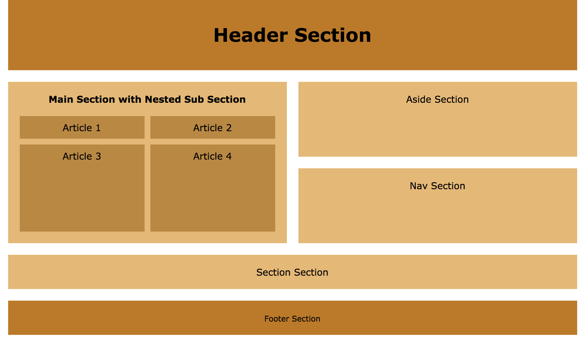
    <figcaption>&nbsp;&nbsp;&nbsp; Image - Netsted grid template web layout </figcaption>
  </figure>
</p>

<hr/>

```css
.nested-grid-container {
  margin-top: 20px;
  display: grid;
  /*  grid-template-columns: 1fr 1fr 1fr 1fr;
  grid-template-rows: 150px; */
  grid-gap:10px;

  /* */
  /* grid-template-columns: 1fr 1fr;
  grid-template-rows: auto 150px; */

  /* */
  grid-template-columns: 1fr 1fr;
}
```

<p>
  <figure>
    &nbsp;&nbsp;&nbsp; 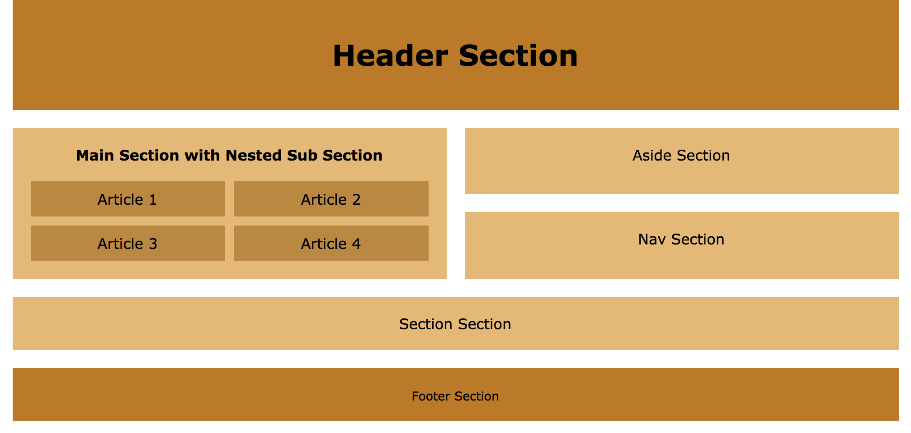
    <figcaption>&nbsp;&nbsp;&nbsp; Image - Netsted grid template web layout </figcaption>
  </figure>
</p>

3 CSS Grid Item Properties
===================== 

Let us look into the some of the important properties used with and applicable to Grid Item or Child Elements (usually known as `Items`, present inside Grid container):
- **`grid-column-start`**
    - Determines/indicates the column grid line where the grid item starts
    - Specifies a grid item's start position/location within the grid column
- **`grid-column-end`** 
    - Determines/indicates the column grid line where the grid item ends
    - Specifies a grid item's end position/location within the grid column
- **`grid-row-start`**
    - Determines/indicates the row grid line where the grid item starts
    - Specifies a grid item's start position/location within the grid row
- **`grid-row-end`**
    - Determines/indicates the row grid line where the grid item ends
    - Specifies a grid item's end position/location within the grid row
- **`grid-column`**
    - Shorthand property that sets the start line and end line *grid-column-start* and *grid-column-end* for the respective dimensions in the same declaration
- **`grid-row`**
    - Shorthand property that sets the start line and end line *grid-row-start* and *grid-row-end* for the respective dimensions in the same declaration
- **`grid-area`**
    - Gives an item a name so that it can be referenced by a template created with the containers *grid-template-areas* property
    - Alternatively its shorthand property for *grid-row-start*, *grid-column-start*, *grid-row-end* and *grid-column-end*
- **`justify-self`**
    - Aligns a grid item inside a cell along the inline (row) axis, this value applies to a grid item inside a single cell
- **`align-self`**
    - Aligns a grid item inside a cell along the block (column), this value applies to the content inside a single grid item
- **`place-self`**
    -  Shorthand property sets both the *align-self* and *justify-self* properties

3.1. Grid Lines Columns
---------------------
3.1. Grid Lines - Columns grid-column-start & grid-column-end
---------------------

- **`grid-column-start`**
    - Determines/indicates the column grid line where the grid item starts
    - Specifies a grid item's start position/location within the grid column
- **`grid-column-end`** 
    - Determines/indicates the column grid line where the grid item ends
    - Specifies a grid item's end position/location within the grid column
- syntax:
```css 
.grid-item {
  grid-column-start: <number> | <name> | span <number> | span <name> | auto;
  grid-column-end: <number> | <name> | span <number> | span <name> | auto;

  grid-column-start: 1;
  grid-column-end: 3;
}
```

> **Syntax & Example**: `3.1.1-grid-lines-grid-column-start-end-web-layout.html`

```html
<!DOCTYPE html>

<html lang="en">

  <head>
    <meta charset="UTF-8">
    <meta name="viewport" content="width=device-width, initial-scale=1.0">
    <meta http-equiv="X-UA-Compatible" content="ie=edge">
    <title>3.1.1-grid-lines-grid-column-start-end-web-layout.html</title>

    <style type="text/css">

      body {
        margin: 0;
        padding: 0;
        font-family: verdana;

        color: #ffffff;
        font-size: 1rem;
        text-align: center;
      }

      .main-container {
        width: 980px;
        margin: 0 auto;
      
        display: grid; /* block level grid container */
        grid-template-columns: repeat(6, 1fr);
        grid-template-rows: repeat(4, minmax(70px, auto));
        grid-gap: 20px;
      }

      .main-container > * {
        background-color: #ff7f50;
        padding: 20px;
      }

      .header-section {
        background-color: #e03f00;
        grid-column-start: 1;
        grid-column-end: 7;
      }

      .main-section {
        grid-column-start: 1;
        grid-column-end: 5;
      }
      
      .aside-section {
        grid-column-start: 5;
        grid-column-end: 7;
      }

      .nav-section {
        grid-column-start: 1;
        grid-column-end: 3;
      }

      .section {
        grid-column-start: 3;
        grid-column-end: 7;
      }

      .footer-section {
        background-color: #e03f00;
        grid-column-start: 1;
        grid-column-end: 7;
      }
    </style>

  </head>

  <body>

    <div class="main-container">
      <header class="header-section"><h1>Header Section</h1></header>
      <main class="main-section">Main Section</main>
      <aside class="aside-section">Aside Section</aside>
      <nav class="nav-section">Nav Section</nav>
      <section class="section">Section Section</section>
      <footer class="footer-section"><small>Footer Section</small></footer>
    </div>
    
  </body>
  
</html>
```

<p>
  <figure>
    &nbsp;&nbsp;&nbsp; 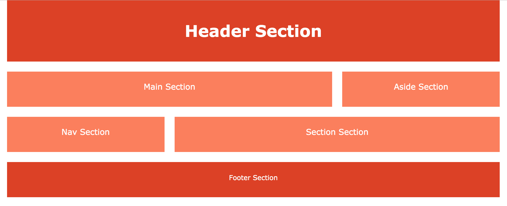
    <figcaption>&nbsp;&nbsp;&nbsp; Image - grid-column-start, grid-column-end </figcaption>
  </figure>
</p>

<hr/>

> **Syntax & Example**: `3.1.2-grid-lines-grid-column-start-end-web-layout.html`

```css
.main-container {
  width: 980px;
  margin: 0 auto;

  display: grid; /* block level grid container */
  grid-template-columns: repeat(6, 1fr);
  grid-template-rows: repeat(5, minmax(70px, auto));
  grid-gap: 20px;
}

.header-section {
  background-color: #e03f00;
  grid-column-start: 1;
  grid-column-end: 7;
}

.main-section {
  grid-column-start: 2;
  grid-column-end: 6;
}

.aside-section {
  grid-column-start: 1;
  grid-column-end: 4;
}

.nav-section {
  grid-column-start: 4;
  grid-column-end: 7;
}

.section {
  grid-column-start: 2;
  grid-column-end: 6;
}

.footer-section {
  background-color: #e03f00;
  grid-column-start: 1;
  grid-column-end: 7;
}
```

<p>
  <figure>
    &nbsp;&nbsp;&nbsp; 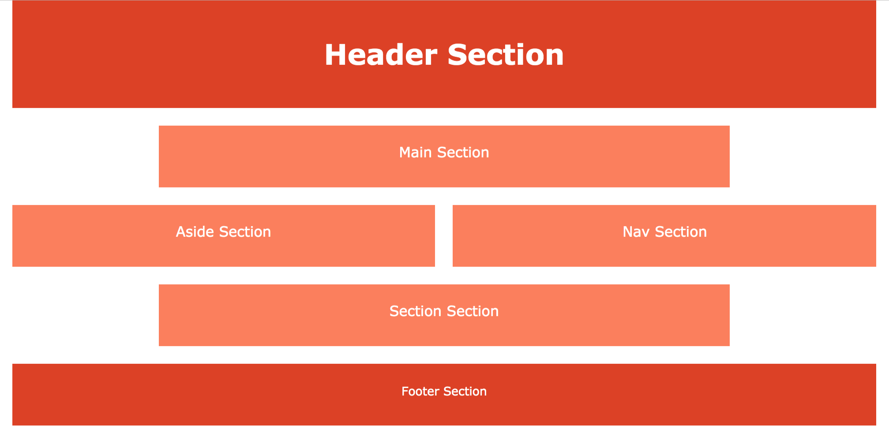
    <figcaption>&nbsp;&nbsp;&nbsp; Image - grid-column-start, grid-column-end </figcaption>
  </figure>
</p>

3.2. Grid Lines Rows
---------------------
3.2. Grid Lines - Rows grid-rows-start & grid-rows-end
---------------------

- **`grid-row-start`**
    - Determines/indicates the row grid line where the grid item starts
    - Specifies a grid item's start position/location within the grid row
- **`grid-row-end`**
    - Determines/indicates the row grid line where the grid item ends
    - Specifies a grid item's end position/location within the grid row
- syntax:
```css 
.grid-item {
  grid-row-start: <number> | <name> | span <number> | span <name> | auto;
  grid-row-end: <number> | <name> | span <number> | span <name> | auto;

  grid-row-start: 1;
  grid-row-end: 3;
}
```

> **Syntax & Example**: `3.2.1-grid-lines-grid-row-start-end-web-layout.html`

```html
<!DOCTYPE html>

<html lang="en">

  <head>
    <meta charset="UTF-8">
    <meta name="viewport" content="width=device-width, initial-scale=1.0">
    <meta http-equiv="X-UA-Compatible" content="ie=edge">
    <title>3.2.1-grid-lines-grid-row-start-end-web-layout.html</title>

    <style type="text/css">

      body {
        margin: 0;
        padding: 0;
        font-family: verdana;

        color: #ffffff;
        font-size: 1rem;
        text-align: center;
      }

      .main-container {
        width: 980px;
        margin: 0 auto;
      
        display: grid; /* block level grid container */
        grid-template-columns: repeat(6, 1fr);
        grid-template-rows: repeat(5, minmax(70px, auto));
        grid-gap: 20px;
      }

      .main-container > * {
        background-color: #ff6c88;
        padding: 20px;
      }

      .header-section {
        background-color: #ed143d;
        grid-column-start: 1;
        grid-column-end: 7;
      }

      .main-section {
        grid-column-start: 1;
        grid-column-end: 5;

        grid-row-start:2;
        grid-row-end:4;
      }
      
      .aside-section {
        grid-column-start: 5;
        grid-column-end: 7;

        grid-row-start:3;
        grid-row-end:4;
      }

      .nav-section {
        grid-column-start: 1;
        grid-column-end: 3;
        
      }

      .section {
        grid-column-start: 3;
        grid-column-end: 7;

        grid-row-start:4;
        grid-row-end:6;
      }

      .footer-section {
        background-color: #ed143d;
        grid-column-start: 1;
        grid-column-end: 7;
      }
    </style>

  </head>

  <body>

    <div class="main-container">
      <header class="header-section"><h1>Header Section</h1></header>
      <main class="main-section">Main Section</main>
      <aside class="aside-section">Aside Section</aside>
      <nav class="nav-section">Nav Section</nav>
      <section class="section">Section Section</section>
      <footer class="footer-section"><small>Footer Section</small></footer>
    </div>
    
  </body>
  
</html>
```

<p>
  <figure>
    &nbsp;&nbsp;&nbsp; 
    <figcaption>&nbsp;&nbsp;&nbsp; Image - grid-row-start, grid-row-end </figcaption>
  </figure>
</p>

<hr/>

<p>
  <figure>
    &nbsp;&nbsp;&nbsp; 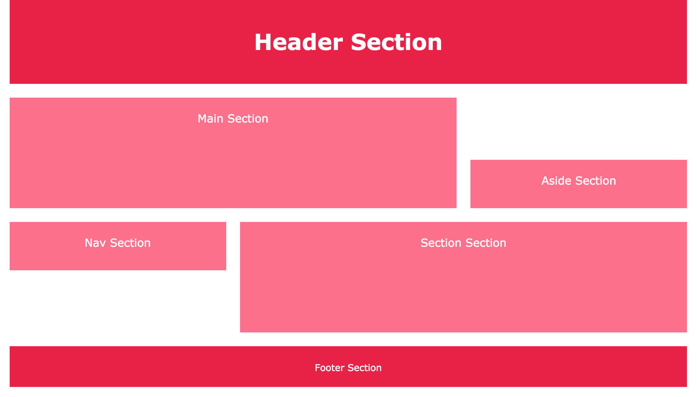
    <figcaption>&nbsp;&nbsp;&nbsp; Image - grid-row-start, grid-row-end </figcaption>
  </figure>
</p>

<hr/>

> **Syntax & Example**: `3.2.2-grid-lines-grid-row-start-end-web-layout.html`

```html
<!DOCTYPE html>

<html lang="en">

  <head>
    <meta charset="UTF-8">
    <meta name="viewport" content="width=device-width, initial-scale=1.0">
    <meta http-equiv="X-UA-Compatible" content="ie=edge">
    <title>3.2.2-grid-lines-grid-row-start-end-web-layout.html</title>

    <style type="text/css">

      body {
        margin: 0;
        padding: 0;
        font-family: verdana;

        color: #ffffff;
        font-size: 1rem;
        text-align: center;
      }

      .main-container {
        width: 980px;
        margin: 0 auto;
      
        display: grid; /* block level grid container */
        grid-template-columns: repeat(6, 1fr);
        grid-template-rows: repeat(6, minmax(70px, auto));
        grid-gap: 20px;
      }

      .main-container > * {
        background-color: #ff6c88;
        padding: 20px;
      }

      .header-section {
        background-color: #ed143d;
        grid-column-start: 1;
        grid-column-end: 7;
      }

      .main-section {
        grid-column-start: 2;
        grid-column-end: 6;
      }
      
      .aside-section {
        grid-column-start: 1;
        grid-column-end: 4;

        grid-row-start: 3;
        grid-row-end: 5;
      }

      .nav-section {
        grid-column-start: 4;
        grid-column-end: 7;
        
        grid-row-start: 3;
        grid-row-end: 5;
      }

      .section {
        grid-column-start: 2;
        grid-column-end: 6;
      }

      .footer-section {
        background-color: #ed143d;
        grid-column-start: 1;
        grid-column-end: 7;
      }
    </style>

  </head>

  <body>

    <div class="main-container">
      <header class="header-section"><h1>Header Section</h1></header>
      <main class="main-section">Main Section</main>
      <aside class="aside-section">Aside Section</aside>
      <nav class="nav-section">Nav Section</nav>
      <section class="section">Section Section</section>
      <footer class="footer-section"><small>Footer Section</small></footer>
    </div>
    
  </body>
  
</html>
```

<p>
  <figure>
    &nbsp;&nbsp;&nbsp; 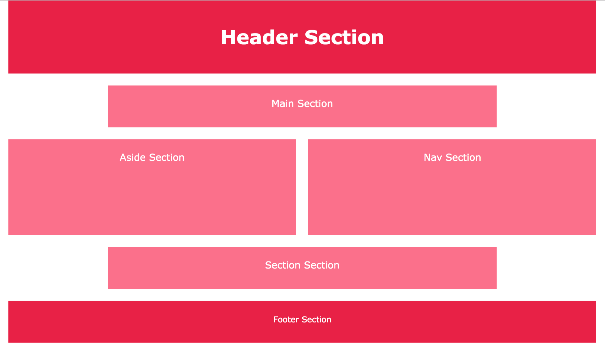
    <figcaption>&nbsp;&nbsp;&nbsp; Image - grid-row-start, grid-row-end </figcaption>
  </figure>
</p>

3.3. Grid Lines Grid Column
---------------------
3.3. Grid Lines - Column grid-column
---------------------

- **`grid-column`**
    - A shorthand property that sets the start line and end line *grid-column-start* and *grid-column-end* for the respective dimensions in the same declaration
- syntax:
```css 
.grid-item {
  grid-column: <start-line> / <end-line> | <start-line> / span <value>;

  /* grid-column-start: 1;
  grid-column-end: 3; */
  
  grid-column: 1/3;
}
```

> **Syntax & Example**: `3.3.1-grid-lines-grid-column-layout.html`

```html
<!DOCTYPE html>

<html lang="en">

  <head>
    <meta charset="UTF-8">
    <meta name="viewport" content="width=device-width, initial-scale=1.0">
    <meta http-equiv="X-UA-Compatible" content="ie=edge">
    <title>3.3.1-grid-lines-grid-column-layout.html</title>

    <style type="text/css">

      body {
        margin: 0;
        padding: 0;
        font-family: verdana;

        color: #ffffff;
        font-size: 1rem;
        text-align: center;
      }

      .main-container {
        width: 980px;
        margin: 0 auto;
      
        display: grid; /* block level grid container */
        grid-template-columns: repeat(6, 1fr);
        grid-template-rows: repeat(4, minmax(70px, auto));
        grid-gap: 20px;
      }

      .main-container > * {
        background-color: #ff7f50;
        padding: 20px;
      }

      .header-section {
        background-color: #e03f00;
        /* grid-column-start: 1;
        grid-column-end: 7; */
        grid-column: 1/7;
      }

      .main-section {
       /*  grid-column-start: 1;
        grid-column-end: 5; */
        grid-column:1/5;
      }
      
      .aside-section {
       /*  grid-column-start: 5;
        grid-column-end: 7; */
        grid-column: 5/7;
      }

      .nav-section {
        /* grid-column-start: 1;
        grid-column-end: 3; */
        grid-column: 1/3;
      }

      .section {
        /* grid-column-start: 3;
        grid-column-end: 7; */
        grid-column: 3/7;
      }

      .footer-section {
        background-color: #e03f00;
        /* grid-column-start: 1;
        grid-column-end: 7; */
        grid-column: 1/7;
      }
    </style>

  </head>

  <body>

    <div class="main-container">
      <header class="header-section"><h1>Header Section</h1></header>
      <main class="main-section">Main Section</main>
      <aside class="aside-section">Aside Section</aside>
      <nav class="nav-section">Nav Section</nav>
      <section class="section">Section Section</section>
      <footer class="footer-section"><small>Footer Section</small></footer>
    </div>
    
  </body>
  
</html>
```

<p>
  <figure>
    &nbsp;&nbsp;&nbsp; 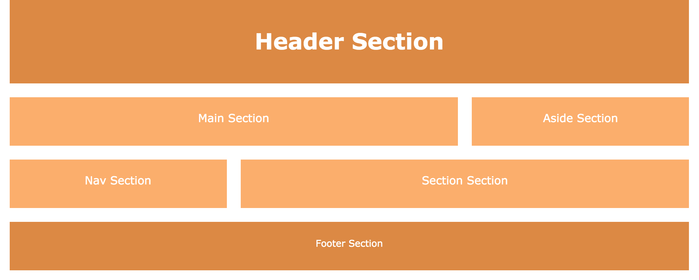
    <figcaption>&nbsp;&nbsp;&nbsp; Image - grid-column-start-end </figcaption>
  </figure>
</p>

<hr/>

> **Syntax & Example**: `3.3.2-grid-lines-grid-column-layout.html`

```css
.main-container {
  width: 980px;
  margin: 0 auto;

  display: grid; /* block level grid container */
  grid-template-columns: repeat(6, 1fr);
  grid-template-rows: repeat(5, minmax(70px, auto));
  grid-gap: 20px;
}

.main-container > * {
  background-color: #ffaf5f;
  padding: 20px;
}

.header-section {
  background-color: #e08931;
  /* grid-column-start: 1;
  grid-column-end: 7; */
  grid-column: 1/7;
}

.main-section {
  /*  grid-column-start: 2;
  grid-column-end: 6; */
  grid-column: 2/6;
}

.aside-section {
  /* grid-column-start: 1;
  grid-column-end: 4; */
  grid-column: 1/4;
}

.nav-section {
  /* grid-column-start: 4;
  grid-column-end: 7; */
  grid-column: 4/7;
}

.section {
  /* grid-column-start: 2;
  grid-column-end: 6; */
  grid-column: 2/6;
}

.footer-section {
  background-color: #e08931;
  /* grid-column-start: 1;
  grid-column-end: 7; */
  grid-column: 1/7;
}
```

<p>
  <figure>
    &nbsp;&nbsp;&nbsp; 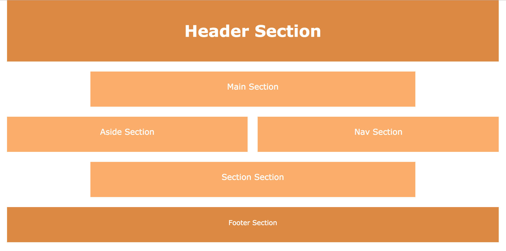
    <figcaption>&nbsp;&nbsp;&nbsp; Image - grid-column-start-end </figcaption>
  </figure>
</p>

3.4. Grid Lines Grid Row
---------------------
3.4. Grid Lines - Rows grid-rows
---------------------

- **`grid-row`**
    - Shorthand property that sets the start line and end line *grid-row-start* and *grid-row-end* for the respective dimensions in the same declaration
- syntax:
```css 
.grid-item {
  grid-row: <start-line> / <end-line> | <start-line> / span <value>;

  /* grid-row-start: 1;
  grid-row-end: 3; */

  grid-row: 1/3;
}
```

> **Syntax & Example**: `3.4.1-grid-lines-grid-row-layout.html`

```html
<!DOCTYPE html>

<html lang="en">

  <head>
    <meta charset="UTF-8">
    <meta name="viewport" content="width=device-width, initial-scale=1.0">
    <meta http-equiv="X-UA-Compatible" content="ie=edge">
    <title>3.4.1-grid-lines-grid-row-layout.html</title>

    <style type="text/css">

      body {
        margin: 0;
        padding: 0;
        font-family: verdana;

        color: #ffffff;
        font-size: 1rem;
        text-align: center;
      }

      .main-container {
        width: 980px;
        margin: 0 auto;
      
        display: grid; /* block level grid container */
        grid-template-columns: repeat(6, 1fr);
        grid-template-rows: repeat(5, minmax(70px, auto));
        grid-gap: 20px;
      }

      .main-container > * {
        background-color: #a9da41;
        padding: 20px;
      }

      .header-section {
        background-color: #739e17;
        /* grid-column-start: 1;
        grid-column-end: 7; */

        grid-column: 1/7;
      }

      .main-section {
        /* grid-column-start: 1;
        grid-column-end: 5;

        grid-row-start:2;
        grid-row-end:4; */
        
        grid-column: 1/5;
        grid-row: 2/4;
      }
      
      .aside-section {
        /* grid-column-start: 5;
        grid-column-end: 7;

        grid-row-start:3;
        grid-row-end:4; */

        grid-column: 5/7;
        grid-row: 3/4;
      }

      .nav-section {
        /* grid-column-start: 1;
        grid-column-end: 3; */
        
        grid-column: 1/3;
      }

      .section {
        /* grid-column-start: 3;
        grid-column-end: 7;

        grid-row-start:4;
        grid-row-end:6; */

        grid-column: 3/7;
        grid-row: 4/6;
      }

      .footer-section {
        background-color: #739e17;
       /*  grid-column-start: 1;
        grid-column-end: 7; */

        grid-column: 1/7;
      }
    </style>

  </head>

  <body>

    <div class="main-container">
      <header class="header-section"><h1>Header Section</h1></header>
      <main class="main-section">Main Section</main>
      <aside class="aside-section">Aside Section</aside>
      <nav class="nav-section">Nav Section</nav>
      <section class="section">Section Section</section>
      <footer class="footer-section"><small>Footer Section</small></footer>
    </div>
    
  </body>
  
</html>
```

<p>
  <figure>
    &nbsp;&nbsp;&nbsp; 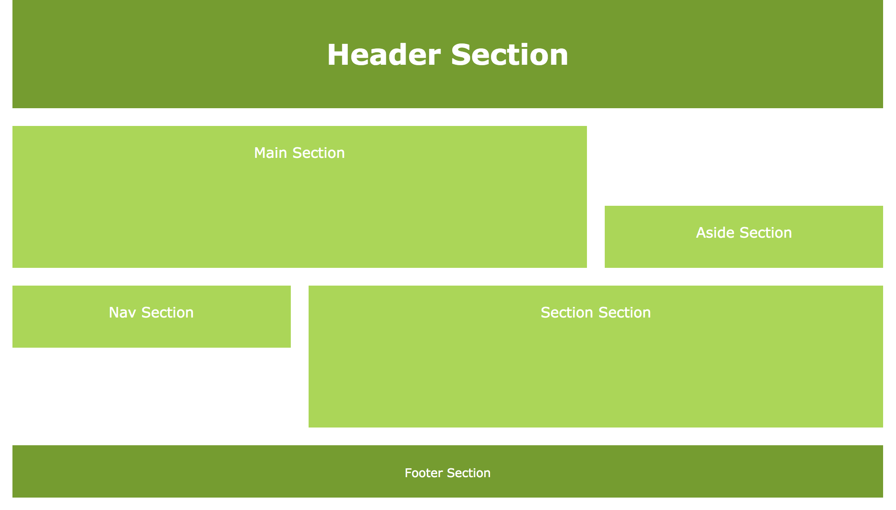
    <figcaption>&nbsp;&nbsp;&nbsp; Image - grid-row-start-end </figcaption>
  </figure>
</p>

<hr/>

> **Syntax & Example**: `3.4.2-grid-lines-grid-row-layout.html`

```html
<!DOCTYPE html>

<html lang="en">

  <head>
    <meta charset="UTF-8">
    <meta name="viewport" content="width=device-width, initial-scale=1.0">
    <meta http-equiv="X-UA-Compatible" content="ie=edge">
    <title>3.4.2-grid-lines-grid-row-layout.html</title>

    <style type="text/css">

      body {
        margin: 0;
        padding: 0;
        font-family: verdana;

        color: #ffffff;
        font-size: 1rem;
        text-align: center;
      }

      .main-container {
        width: 980px;
        margin: 0 auto;
      
        display: grid; /* block level grid container */
        grid-template-columns: repeat(6, 1fr);
        grid-template-rows: repeat(6, minmax(70px, auto));
        grid-gap: 20px;
      }

      .main-container > * {
        background-color: #a9da41;
        padding: 20px;
      }

      .header-section {
        background-color: #739e17;
        /* grid-column-start: 1;
        grid-column-end: 7; */
        grid-column: 1/7;
      }

      .main-section {
        /* grid-column-start: 2;
        grid-column-end: 6; */
        grid-column: 2/6;
      }
      
      .aside-section {
        /* grid-column-start: 1;
        grid-column-end: 4;

        grid-row-start: 3;
        grid-row-end: 5; */
        grid-column: 1/4;
        grid-row:3/5;
      }

      .nav-section {
       /*  grid-column-start: 4;
        grid-column-end: 7;
        
        grid-row-start: 3;
        grid-row-end: 5; */
        grid-column: 4/7;
        grid-row: 3/5;
      }

      .section {
        /* grid-column-start: 2;
        grid-column-end: 6; */
        grid-column: 2/6;
      }

      .footer-section {
        background-color: #739e17;
        /* grid-column-start: 1;
        grid-column-end: 7; */
        grid-column: 1/7;
      }
    </style>

  </head>

  <body>

    <div class="main-container">
      <header class="header-section"><h1>Header Section</h1></header>
      <main class="main-section">Main Section</main>
      <aside class="aside-section">Aside Section</aside>
      <nav class="nav-section">Nav Section</nav>
      <section class="section">Section Section</section>
      <footer class="footer-section"><small>Footer Section</small></footer>
    </div>
    
  </body>
  
</html>
```

<p>
  <figure>
    &nbsp;&nbsp;&nbsp; 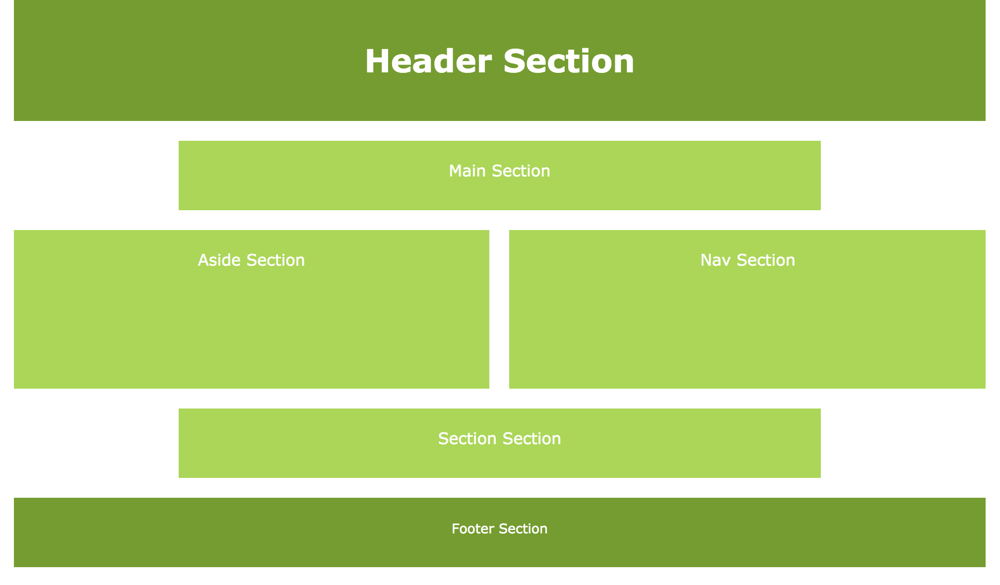
    <figcaption>&nbsp;&nbsp;&nbsp; Image - grid-row-start-end </figcaption>
  </figure>
</p>

<hr/>

> **Syntax & Example**: `3.4.3-grid-lines-grid-column-row-layout-span.html`

```html
<!DOCTYPE html>

<html lang="en">

  <head>
    <meta charset="UTF-8">
    <meta name="viewport" content="width=device-width, initial-scale=1.0">
    <meta http-equiv="X-UA-Compatible" content="ie=edge">
    <title>3.4.3-grid-lines-grid-column-row-layout-span.html</title>

    <style type="text/css">

      body {
        margin: 0;
        padding: 0;
        font-family: verdana;

        color: #ffffff;
        font-size: 1rem;
        text-align: center;
      }

      .main-container {
        width: 980px;
        margin: 0 auto;
      
        display: grid; /* block level grid container */
        grid-template-columns: repeat(6, 1fr);
        grid-template-rows: repeat(6, minmax(70px, auto));
        grid-gap: 20px;
      }

      .main-container > * {
        background-color: #ddd459;
        padding: 20px;
      }

      .header-section {
        background-color:#aaa459;
        /* grid-column-start: 1;
        grid-column-end: 7; */
        
        /* grid-column: 1/7; */
        
        /* grid-column: 1 / -1; */ /* Negative ie -1 is used for last-till end column/row */
        /* grid-column: span 6; */ /* cover-span 6 columns/row */
        grid-column: 1 / span 6; /* start from 1st track and cover-span 6 */
      }

      .main-section {
        /* grid-column-start: 2;
        grid-column-end: 6; */
        
        /* grid-column: 2/6; */

        grid-column: 2 / span 4;
      }
      
      .aside-section {
        /* grid-column-start: 1;
        grid-column-end: 4;

        grid-row-start: 3;
        grid-row-end: 5; */
        
        /* grid-column: 1/4;
        grid-row:3/5; */
        
        grid-column: 1 / span 3;
        grid-row: 3 / span 2;
      }

      .nav-section {
       /*  grid-column-start: 4;
        grid-column-end: 7;
        
        grid-row-start: 3;
        grid-row-end: 5; */
        
        /* grid-column: 4/7;
        grid-row: 3/5; */

        grid-column: 4 / span 3;
        grid-row: 3 / span 2;
      }

      .section {
        /* grid-column-start: 2;
        grid-column-end: 6; */
        
        /* grid-column: 2/6; */

        grid-column: 2 / span 4;
      }

      .footer-section {
        background-color:#aaa459;
        /* grid-column-start: 1;
        grid-column-end: 7; */
        
        /* grid-column: 1/7; */

        /* grid-column: 1 / -1; */ 
        /* grid-column: span 6; */ 
        
        grid-column: 1 / span 6;  
      }
    </style>

  </head>

  <body>

    <div class="main-container">
      <header class="header-section"><h1>Header Section</h1></header>
      <main class="main-section">Main Section</main>
      <aside class="aside-section">Aside Section</aside>
      <nav class="nav-section">Nav Section</nav>
      <section class="section">Section Section</section>
      <footer class="footer-section"><small>Footer Section</small></footer>
    </div>
    
  </body>
  
</html>
```

<p>
  <figure>
    &nbsp;&nbsp;&nbsp; 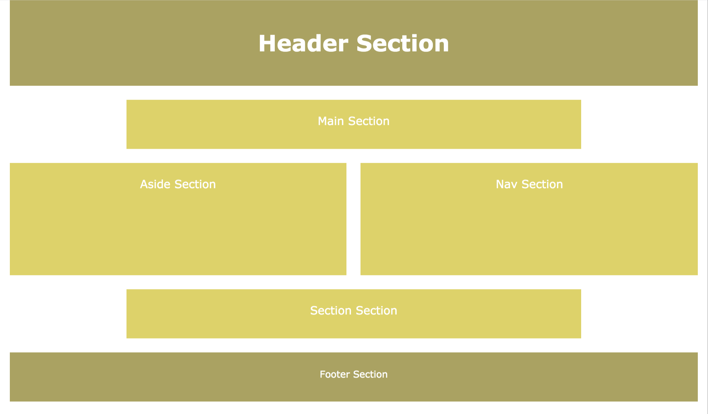
    <figcaption>&nbsp;&nbsp;&nbsp; Image - grid-column-row with span </figcaption>
  </figure>
</p>

<hr/>

> **Syntax & Example**: `3.4.4-grid-lines-grid-column-row-layout-span.html`

```html
<!DOCTYPE html>

<html lang="en">

  <head>
    <meta charset="UTF-8">
    <meta name="viewport" content="width=device-width, initial-scale=1.0">
    <meta http-equiv="X-UA-Compatible" content="ie=edge">
    <title>3.4.4-grid-lines-grid-column-row-layout-span.html</title>

    <style type="text/css">

      body {
        margin: 0;
        padding: 0;
        font-family: verdana;

        color: #ffffff;
        font-size: 1rem;
        text-align: center;
      }

      .main-container {
        width: 980px;
        margin: 0 auto;
      
        display: grid; /* block level grid container */
        grid-template-columns: repeat(4, 1fr 1fr);
        grid-template-rows: repeat(10, 60px);
        grid-gap: 10px;
      }

      .main-container > * {
        background-color:#00bfff;
        padding: 20px;
        border: 2px solid #0000004f;
      }

      .item {
        /* display: grid;
        justify-content: center;
        align-items: center; */
      }

      .item1 {
        /* grid-column: 2 / 4; */
        grid-column: 2 / span 2;
      }

      .item2 {
        /* grid-column: 4 / -1; */
        grid-column: 4 / span 5;
      }

      .item3, .item4 {
        grid-column: span 2;
        grid-row: span 2;
      }

      .item6, .item8 {
        grid-row: span 2;
      }

      .item11 {
        grid-column: 1 / -1;
        /* grid-column: 1 / span 8; */
      }

      .item12, .item14  {
        grid-column: span 3;
        grid-row: span 3;
      }

      .item13, .item15  {
        grid-row: span 3;
      }

      .item16, .item17 {
        grid-column: span 4;
      }

      .item18 {
        grid-column: 2 / span 6;
      }

      .item19 {
        grid-column: 1 / span 8;
      }

    </style>

  </head>

  <body>

    <div class="main-container">
      <div class="item item1">Item 1 LOGO </div>
      <div class="item item2">Item 2 NAVIGATION BAR </div>
      <div class="item item3">Item 3</div>
      <div class="item item4">Item 4</div>
      <div class="item item5">Item 5</div>
      <div class="item item6">Item 6</div>
      <div class="item item7">Item 7</div>
      <div class="item item8">Item 8</div>
      <div class="item item9">Item 9</div>
      <div class="item item10">Item 10</div>
      <div class="item item11">Item 11</div>
      <div class="item item12">Item 12</div>
      <div class="item item13">Item 13</div>
      <div class="item item14">Item 14</div>
      <div class="item item15">Item 15</div>
      <div class="item item16">Item 16</div>
      <div class="item item17">Item 17</div>
      <div class="item item18">Item 18</div>
      <div class="item item19">Item 19</div>
      <div class="item item20">Item 20</div>
      <div class="item item21">Item 21</div>
      <div class="item item22">Item 22</div>
      <div class="item item23">Item 23</div>
      <div class="item item24">Item 24</div>
      <div class="item item25">Item 25</div>
      <div class="item item26">Item 26</div>
      <div class="item item27">Item 27</div>
      <div class="item item28">Item 28</div>
      <div class="item item29">Item 29</div>
      <div class="item item30">Item 30</div>
    </div>
    
  </body>
  
</html>
```

<p>
  <figure>
    &nbsp;&nbsp;&nbsp; 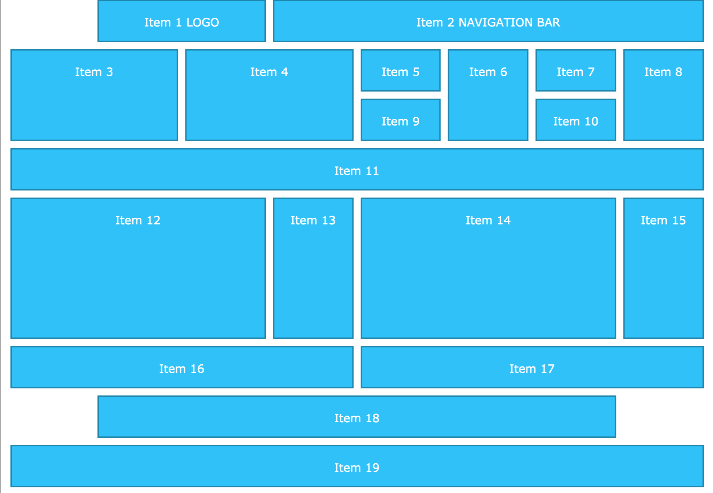
    <figcaption>&nbsp;&nbsp;&nbsp; Image - grid-column-row with span </figcaption>
  </figure>
</p>

3.5. Alignment and Justifying items
---------------------
3.5. Alignment & Justify items - justify-self & align-self
---------------------

- **`justify-self`**
    - Aligns a grid item inside a cell along the inline (row - horizontal) axis, this value applies to a grid item inside a single cell
- **`align-self`**
    - Aligns a grid item inside a cell along the block (column - vertical), this value applies to the content inside a single grid item
- syntax:
```css 
.grid-item {
  justify-self: start | end | center | stretch;

  align-self: start | end | center | stretch;
}
```

> **Syntax & Example**: `3.5-grid-item-alignment-justify-align-self.html`

```html
<!DOCTYPE html>

<html lang="en">

  <head>
    <meta charset="UTF-8">
    <meta name="viewport" content="width=device-width, initial-scale=1.0">
    <meta http-equiv="X-UA-Compatible" content="ie=edge">
    <title>3.5-grid-item-alignment-justify-align-self.html</title>

    <style type="text/css">

      body {
        margin: 0;
        padding: 0;
        font-family: verdana;
      }

      .main-container {
        width: 1000px;
        margin: 0 auto;

        /* 3.5.1 */
        display: grid;
        grid-template-columns: repeat(3, 1fr);
        grid-auto-rows: minmax(200px, auto);
        grid-gap: 10px;
      }

      .item {
        color: #ffffff;
        font-size: 1rem;
        padding: 0.75rem;
        text-align: center;
      }

      .main-container div:nth-child(odd) {
        background: #ffa500;
      }

      .main-container div:nth-child(even) {
        background: #008080;
      }

      .item {
        color: #ffffff;
        font-size: 1rem;
        padding: 0.75rem;
        text-align: center;
      }

      .main-container div:nth-child(odd) {
        background: #ffa500;
      }

      .main-container div:nth-child(even) {
        background: #008080;
      }
    </style>

  </head>

  <body>

    <div class="main-container">
      <div class="item item-1">item-1</div>
      <div class="item item-2">item-2</div>
      <div class="item item-3">item-3</div>
      <div class="item item-4">item-4</div>
      <div class="item item-5">item-5</div>
      <div class="item item-6">item-6</div>
      <div class="item item-7">item-7</div>
      <div class="item item-8">item-8</div>
      <div class="item item-9">item-9</div>
    </div>
    
  </body>
  
</html>
```

<p>
  <figure>
    &nbsp;&nbsp;&nbsp; 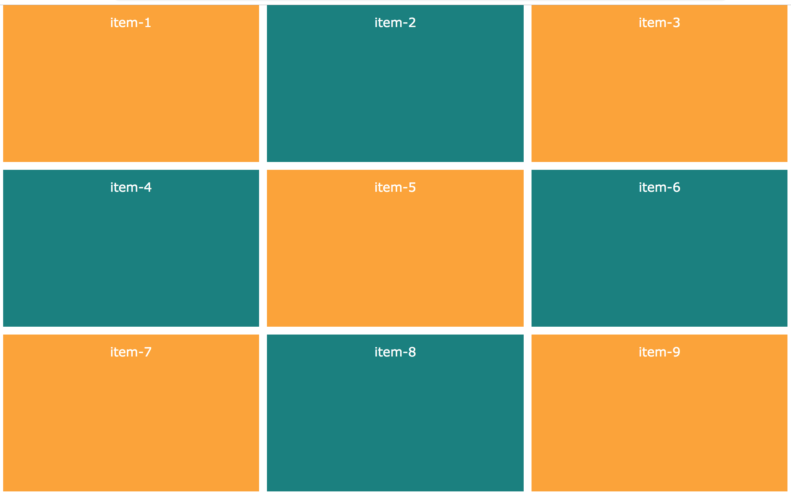
    <figcaption>&nbsp;&nbsp;&nbsp; Image - grid default basic alignment </figcaption>
  </figure>
</p>

<hr/>

```css
.item-1 {
  justify-self: end;
  align-self: end;
}

.item-2 {
  justify-self: center;
  align-self: center;
}

.item-3 {
  justify-self: start;
  align-self: start;
}

.item-7 {
  justify-self: end;
  align-self: start;
}

.item-8 {
  justify-self: center;
  align-self: center;
}

.item-9 {
  justify-self: start;
  align-self: end;
}
```

<p>
  <figure>
    &nbsp;&nbsp;&nbsp; 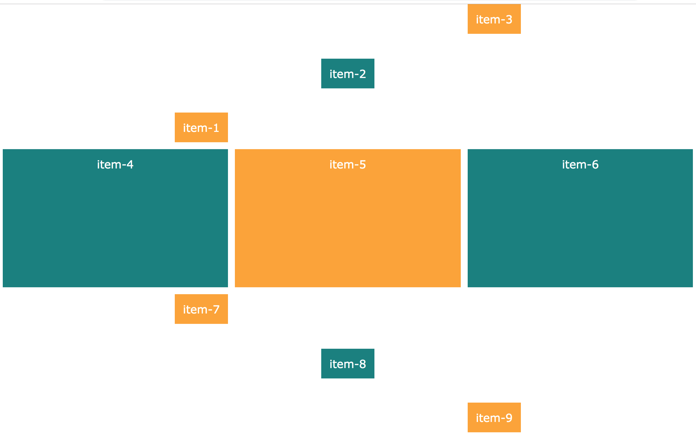
    <figcaption>&nbsp;&nbsp;&nbsp; Image - grid design with justify and align </figcaption>
  </figure>
</p>

<hr/>

```css
.main-container div:nth-child(odd) {
  justify-self: center;
  align-self: center;
}
```

<p>
  <figure>
    &nbsp;&nbsp;&nbsp; 
    <figcaption>&nbsp;&nbsp;&nbsp; Image - grid design with justify and align </figcaption>
  </figure>
</p>

4 CSS Grid Practical Demo Examples
=====================  

4.1. Mosaic Layout
---------------------

> **Syntax & Example**: `4.1-demo-mosaic-layout.html`

```html
<!DOCTYPE html>

<html lang="en">

  <head>
    <meta charset="UTF-8">
    <meta name="viewport" content="width=device-width, initial-scale=1.0">
    <meta http-equiv="X-UA-Compatible" content="ie=edge">
    <title>4.1-demo-mosaic-layout.html</title>

    <style type="text/css">

      body {
        margin: 0;
        padding: 0;
        font-family: verdana;
      }

      .main-container {
        width: 1000px;
        margin: 0 auto;

        display: grid;
        grid-template-columns: repeat(6, 1fr);
        grid-auto-rows: minmax(100px, auto);
        grid-gap: 10px;
      }

      .item {
        background-color: #1e90ff;
        color: #ffffff;
        font-size: 1rem;
        padding: 0.75rem;
        text-align: center;
      }

      .item-1 {
        grid-column: 1/3;
        grid-row: 1/5;
      }

      .item-2 {
        grid-column: 3/7;
        grid-row: 1/3;
      }

      .item-3 {
        grid-column: 3/5;
        grid-row: 3/5;
      }

      .item-4 {
        grid-column: 5/7;
        grid-row: 3/7;
      }

      .item-5 {
        grid-column: 1/5;
        grid-row: 5/7;
      }

    </style>

  </head>

  <body>

    <div class="main-container">
      <div class="item item-1">item-1</div>
      <div class="item item-2">item-2</div>
      <div class="item item-3">item-3</div>
      <div class="item item-4">item-4</div>
      <div class="item item-5">item-5</div>
    </div>
    
  </body>
  
</html>
```

<p>
  <figure>
    &nbsp;&nbsp;&nbsp; 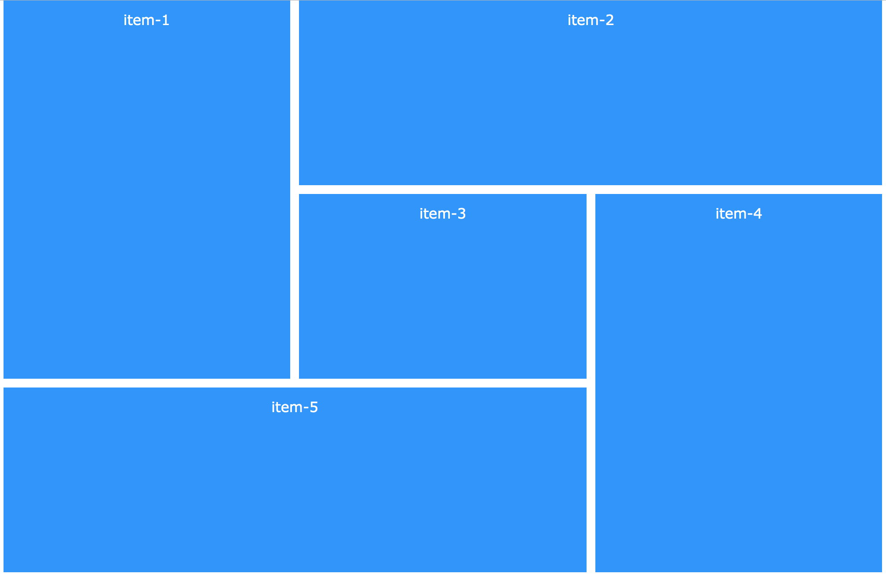
    <figcaption>&nbsp;&nbsp;&nbsp; Image - Demo Example: Grid Mosaic Layout </figcaption>
  </figure>
</p>

<hr/>

```css
.main-container {
  width: 1000px;
  margin: 0 auto;

  display: grid;
  grid-template-columns: repeat(6, 1fr);
  grid-auto-rows: minmax(150px, auto);
  grid-gap: 10px;

  transform: rotate(45deg) scale(0.5);  
}
```

<p>
  <figure>
    &nbsp;&nbsp;&nbsp; 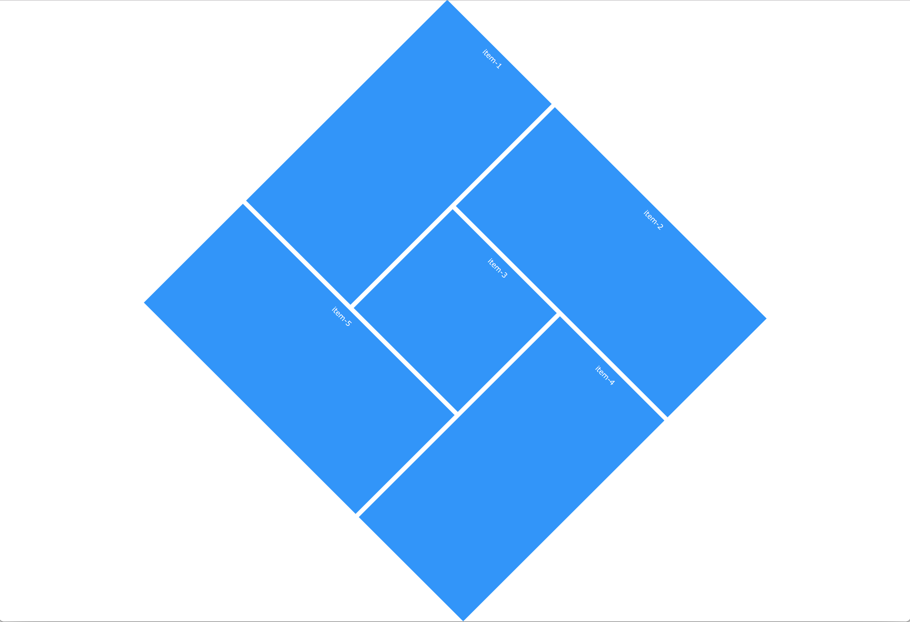
    <figcaption>&nbsp;&nbsp;&nbsp; Image - Demo Example: Grid Mosaic Layout Transform Rotate </figcaption>
  </figure>
</p>

4.2. Responsive Grid Layout
---------------------

> **Syntax & Example**: `4.2-demo-responsive-grid-layout.html`

```html
<!DOCTYPE html>

<html lang="en">

  <head>
    <meta charset="UTF-8">
    <meta name="viewport" content="width=device-width, initial-scale=1.0">
    <meta http-equiv="X-UA-Compatible" content="ie=edge">
    <title>4.2-demo-responsive-grid-layout.html</title>

    <style type="text/css">

      body {
        margin: 0;
        padding: 0;
        font-family: verdana;

        color: #ffffff;
        font-size: 1rem;
        text-align: center;
      }

      /* Desktop view */
      @media screen and (min-width: 760px){

        .main-container {
          width: 980px;
          margin: 0 auto;

          display: grid; /* block level grid container */
          grid-template-columns: repeat(4, 1fr);
          grid-auto-rows: minmax(80px, auto);
          grid-gap: 20px;

          grid-template-areas: 
            "headerArea headerArea headerArea headerArea"
            "asideArea asideArea mainArea mainArea "
            "navArea navArea mainArea mainArea "
            "sectionArea sectionArea sectionArea sectionArea"
            "sectionArea sectionArea sectionArea sectionArea"
            "footerArea footerArea footerArea footerArea";
        }
      }

      .main-container > * {
        background-color: #00bcd4;
        padding: 20px;
      }

      .header-section {
        grid-area: headerArea;
        background-color: #0199ad;
      }

      .main-section {
        grid-area: mainArea;
      }

      .section {
        grid-area: sectionArea;
      }

      .aside-section {
        grid-area: asideArea;
      }

      .nav-section {
        grid-area: navArea;
      }

      .footer-section {
        grid-area: footerArea;
        background-color: #0199ad;
      }
    </style>

  </head>

  <body>

    <div class="main-container">
      <header class="header-section"><h1>Header Section</h1></header>
      <main class="main-section">Main Section</main>
      <section class="section">Section Section</section>
      <aside class="aside-section">Aside Section</aside>
      <nav class="nav-section">Nav Section</nav>
      <footer class="footer-section"><small>Footer Section</small></footer>
    </div>
    
  </body>
  
</html>
```

<p>
  <figure>
    &nbsp;&nbsp;&nbsp; 
    <figcaption>&nbsp;&nbsp;&nbsp; Image - Demo Example: Responsive Grid Layout Desktop view </figcaption>
  </figure>
</p>

<hr/>

<p>
  <figure>
    &nbsp;&nbsp;&nbsp; 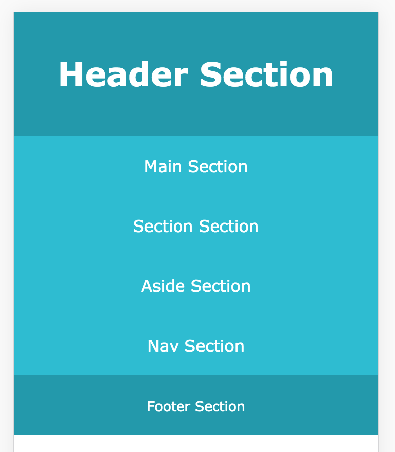
    <figcaption>&nbsp;&nbsp;&nbsp; Image - Demo Example: Responsive Grid Layout Mobile Basic view </figcaption>
  </figure>
</p>

<hr/>

```css
/* Mobile basic view is defualt, we get just after applying desktop media query */

/* Mobile enhanced view */
@media screen and (max-width: 760px) {

  body {
    font-size: 2rem;
  }

  .main-container > * {
    padding: 40px !important;
  }
  
  .main-container {
    width: 980px;
    margin: 0 auto;

    display: grid; /* block level grid container */
    grid-template-columns: repeat(4, 1fr);
    grid-auto-rows: minmax(100px, auto);
    grid-gap: 30px;

    grid-template-areas: 
      "headerArea headerArea headerArea headerArea"
      "footerArea footerArea footerArea footerArea"
      "mainArea mainArea mainArea mainArea"
      "mainArea mainArea mainArea mainArea"
      "asideArea asideArea navArea navArea"
      "sectionArea sectionArea sectionArea sectionArea"
      "sectionArea sectionArea sectionArea sectionArea";
  }
}
```

<p>
  <figure>
    &nbsp;&nbsp;&nbsp; 
    <figcaption>&nbsp;&nbsp;&nbsp; Image - Demo Example: Responsive Grid Layout Mobile enahnced view </figcaption>
  </figure>
</p>

4.3. Custom 12 Column Grid
---------------------
4.3. Create Custom 12 Column Grid Layout/Framework
---------------------

> **Syntax & Example**: `4.3-demo-custom-12-column-grid-framework.html`

```html
<!DOCTYPE html>

<html lang="en">

  <head>
    <meta charset="UTF-8">
    <meta name="viewport" content="width=device-width, initial-scale=1.0">
    <meta http-equiv="X-UA-Compatible" content="ie=edge">
    <title>4.3-demo-custom-12-column-grid-framework.html</title>

    <style type="text/css">

      body {
        margin: 0;
        padding: 0;
        font-family: verdana;

        color: #ffffff;
        font-size: 1rem;
        text-align: center;
      }

      .main-container {
        width: 960px;
        margin: 0 auto;
      
        display: grid;
        grid-template-columns: repeat(12, 1fr);
        grid-auto-rows: minmax(100px, auto);
        grid-gap: 10px;
      }

      .main-container > * {
        background-color: #b5b5b5;
        padding: 20px;
      }

      .header-section {
        background-color: #5b5b5b;
        grid-column: 1/13;
      }

      .main-section {
       grid-column: 5/13;
       grid-row: 2/4;
      }
      
      .aside-section {
        grid-column: 1/5;
      }

      .nav-section {
        grid-column: 1/5;
      }

      .section {
        grid-column: 1/13;
        grid-row: 4/6;
      }

      .footer-section {
        background-color: #5b5b5b;
        grid-column: 1/13;
      }
    </style>

  </head>

  <body>

    <div class="main-container">
      <header class="header-section"><h1>Header Section</h1></header>
      <main class="main-section">Main Section</main>
      <aside class="aside-section">Aside Section</aside>
      <nav class="nav-section">Nav Section</nav>
      <section class="section">Section Section</section>
      <footer class="footer-section"><small>Footer Section</small></footer>
    </div>
    
  </body>
  
</html>
```

<p>
  <figure>
    &nbsp;&nbsp;&nbsp; 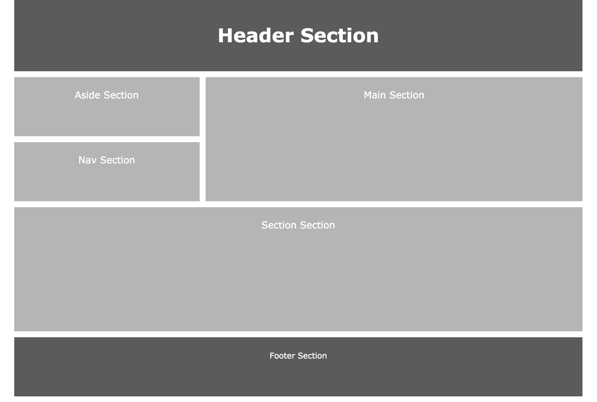
    <figcaption>&nbsp;&nbsp;&nbsp; Image - Demo Example: Grid Column Row Layout </figcaption>
  </figure>
</p>

<hr/>

```html
<!DOCTYPE html>

<html lang="en">

  <head>
    <meta charset="UTF-8">
    <meta name="viewport" content="width=device-width, initial-scale=1.0">
    <meta http-equiv="X-UA-Compatible" content="ie=edge">
    <title>4.3-demo-custom-12-column-grid-framework.html</title>

    <style type="text/css">

      body {
        margin: 0;
        padding: 0;
        font-family: verdana;

        color: #ffffff;
        font-size: 1rem;
        text-align: center;
      }

      .main-container {
        width: 960px;
        margin: 0 auto;
      
        display: grid;
        grid-template-columns: repeat(12, 1fr);
        grid-auto-rows: minmax(100px, auto);
        grid-gap: 10px;

        /* 4.3.2 custom 12 columner grid */
        position: relative;
      }

      /* 4.3.2 custom columner grid */
      #custom-grid-overlay-container {
        display: grid;
        grid-template-columns: repeat(12, 1fr);
        grid-auto-rows: minmax(100%, auto);
          
        position: absolute;
        width: 100%;
        height: 100%; 
        background: transparent;
        padding: 0;
        margin: 0;
      }

      #custom-grid-overlay-container div {
        opacity: 0.25;
        border: 1px solid #ffffff;
      }

      /* */
      .main-container > * {
        background-color: #b5b5b5;
        padding: 20px;
      }

      .header-section {
        background-color: #5b5b5b;
        grid-column: 1/13;
      }

      .main-section {
       grid-column: 5/13;
       grid-row: 2/4;
      }
      
      .aside-section {
        grid-column: 1/5;
      }

      .nav-section {
        grid-column: 1/5;
      }

      .section {
        grid-column: 1/13;
        grid-row: 4/6;
      }

      .footer-section {
        background-color: #5b5b5b;
        grid-column: 1/13;
      }
    </style>

  </head>

  <body>

    <div class="main-container">

      <!-- /* 4.3.2 custom 12 columner grid */ -->
      <section id="custom-grid-overlay-container">
        <div>Column <br/> 1</div>
        <div>Column <br/> 2</div>
        <div>Column <br/> 3</div>
        <div>Column <br/> 4</div>
        <div>Column <br/> 5</div>
        <div>Column <br/> 6</div>
        <div>Column <br/> 7</div>
        <div>Column <br/> 8</div>
        <div>Column <br/> 9</div>
        <div>Column <br/> 10</div>
        <div>Column <br/> 11</div>
        <div>Column <br/> 12</div>
      </section>

      <!-- Basic layout -->
      <header class="header-section"><h1>Header Section</h1></header>
      <main class="main-section">Main Section</main>
      <aside class="aside-section">Aside Section</aside>
      <nav class="nav-section">Nav Section</nav>
      <section class="section">Section Section</section>
      <footer class="footer-section"><small>Footer Section</small></footer>
    </div>
    
  </body>
  
</html>
```

<p>
  <figure>
    &nbsp;&nbsp;&nbsp; 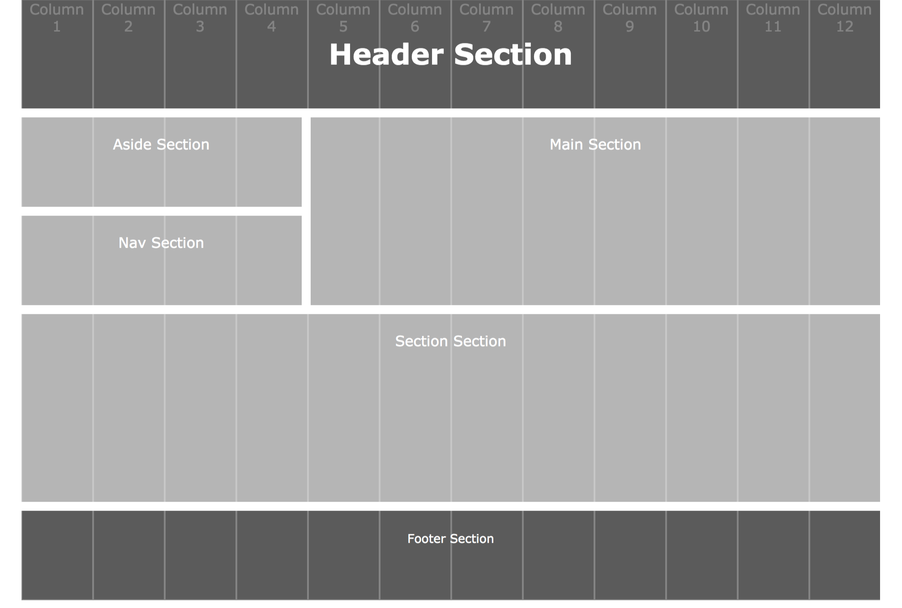
    <figcaption>&nbsp;&nbsp;&nbsp; Image - Demo Example: Custom 12 column grid layout framework </figcaption>
  </figure>
</p>

4.4. Columner Layout with Auto Flow Dense
---------------------

> **Syntax & Example**: `4.4-demo-grid-auto-flow-dense.html`

```html
<!DOCTYPE html>

<html lang="en">

  <head>
    <meta charset="UTF-8">
    <meta name="viewport" content="width=device-width, initial-scale=1.0">
    <meta http-equiv="X-UA-Compatible" content="ie=edge">
    <title>4.4-demo-grid-auto-flow-dense.html</title>

    <style type="text/css">

      body {
        margin: 0;
        padding: 0;
        font-family: verdana;

        color: #ffffff;
        font-size: 1rem;
        text-align: center;
      }

      .main-container {
        width: 960px;
        margin: 0 auto;
      
        display: grid;
        grid-template-columns: repeat(10, 1fr);
        grid-gap: 10px;
        
        /* 4.4.2 - */
        /* grid-auto-flow: dense; */
      }

      .item:nth-child(6n) {
        background-color:#a9a906;
        
        /* 4.4.1 - right side every 6th column should cover span remaining space */
        grid-column: span 5;
        
        /* 4.4.2 - */
        /* grid-column: span 6; */
      }

      .main-container > * {
        background-color: #dcdc65;
        padding: 20px;
      }
    </style>

  </head>

  <body>

    <div class="main-container">

      <div class="item item1">1</div>
      <div class="item item2">2</div>
      <div class="item item3">3</div>
      <div class="item item4">4</div>
      <div class="item item5">5</div>
      <div class="item item6">6</div>
      <div class="item item7">7</div>
      <div class="item item8">8</div>
      <div class="item item9">9</div>
      <div class="item item10">10</div>
      <div class="item item11">11</div>
      <div class="item item12">12</div>
      <div class="item item13">13</div>
      <div class="item item14">14</div>
      <div class="item item15">15</div>
      <div class="item item16">16</div>
      <div class="item item17">17</div>
      <div class="item item18">18</div>
      <div class="item item19">19</div>
      <div class="item item20">20</div>
      <div class="item item21">21</div>
      <div class="item item22">22</div>
      <div class="item item23">23</div>
      <div class="item item24">24</div>
      <div class="item item25">25</div>
      <div class="item item26">26</div>
      <div class="item item27">27</div>
      <div class="item item28">28</div>
      <div class="item item29">29</div>
      <div class="item item30">30</div>
      <div class="item item31">31</div>
      <div class="item item32">32</div>
      <div class="item item33">33</div>
      <div class="item item34">34</div>
      <div class="item item35">35</div>
      <div class="item item36">36</div>
      <div class="item item37">37</div>
      <div class="item item38">38</div>
      <div class="item item39">39</div>
      <div class="item item40">40</div>
      <div class="item item41">41</div>
      <div class="item item42">42</div>
      <div class="item item43">43</div>
      <div class="item item44">44</div>
      <div class="item item45">45</div>
      <div class="item item46">46</div>
      <div class="item item47">47</div>
      <div class="item item48">48</div>
      <div class="item item49">49</div>
      <div class="item item50">50</div>
      <div class="item item51">51</div>
      <div class="item item52">52</div>
      <div class="item item53">53</div>
      <div class="item item54">54</div>
      <div class="item item55">55</div>
      <div class="item item56">56</div>
      <div class="item item57">57</div>
      <div class="item item58">58</div>
      <div class="item item59">59</div>
      <div class="item item60">60</div>
    
  </body>
  
</html>
```

<p>
  <figure>
    &nbsp;&nbsp;&nbsp; 
    <figcaption>&nbsp;&nbsp;&nbsp; Image - Demo Example: Columner Layout </figcaption>
  </figure>
</p>

<hr/>

```css
.main-container {
  width: 960px;
  margin: 0 auto;

  display: grid;
  grid-template-columns: repeat(10, 1fr);
  grid-gap: 10px;
  
  /* 4.4.2 - */
  grid-auto-flow: dense;
}

.item:nth-child(6n) {
  background-color:#a9a906;
  
  /* 4.4.1 - right side every 6th column should cover span remaining space */
  /* grid-column: span 5; */
  
  /* 4.4.2 - */
  grid-column: span 6;
}
```

<p>
  <figure>
    &nbsp;&nbsp;&nbsp; 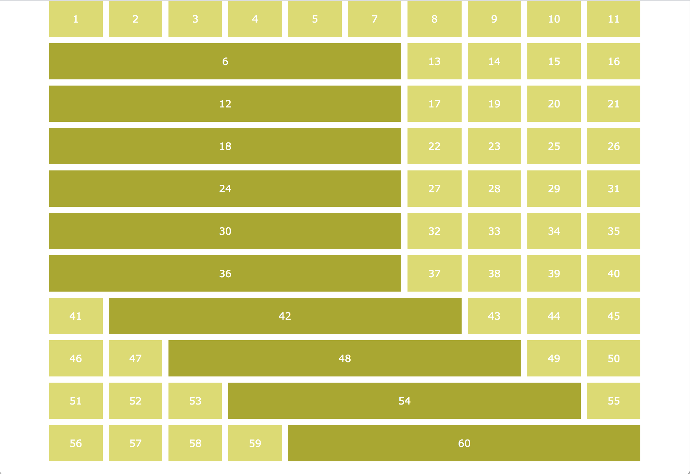
    <figcaption>&nbsp;&nbsp;&nbsp; Image - Demo Example: Columner Layout with Auto-flow: dense </figcaption>
  </figure>
</p>

4.5. Grid Card Layout
---------------------

> **Syntax & Example**: `4.5-demo-grid-card-layout.html`

```html
<!DOCTYPE html>

<html lang="en">

  <head>
    <meta charset="UTF-8">
    <meta name="viewport" content="width=device-width, initial-scale=1.0">
    <meta http-equiv="X-UA-Compatible" content="ie=edge">
    <title>4.5-demo-grid-card-layout.html</title>

    <style type="text/css">

      body {
        margin: 0;
        padding: 0;
        font-family: verdana;
      }

      .main-container {
        width: 960px;
        margin: 0 auto;

        display: grid;
        grid-template-columns: repeat(4, 1fr);
        /* grid-auto-rows: minmax(300px, auto); */
        grid-gap: 10px;
      }

      .card {
        color: #000000;
        border: 2px solid #000000;
        font-size: 1rem;
        padding: 1rem;
        text-align: left;
      }

      .card .logo-holder{
        background-color: #ffdab9;
        height: 5em;
        margin-bottom: 1em;
      }

      .card .header{
        color: #ffb470;
        font-size: 1.25em;
        font-weight: bold;
        margin-bottom: 0.5em;
      }

      .card .article{
        color:#ddb470;
        font-size: 0.75em;
      }

      .card2 .logo-holder{
        height: 7em;
      }

      .card3 .logo-holder{
        height: 9em;
      }

      .card4 .logo-holder{
        height: 11em;
      }

      .card6 .logo-holder, .card7 .logo-holder{
        height: 9em;
      }
    </style>

  </head>

  <body>

    <div class="main-container">

      <div class="card card1">
        <section class="logo-holder"></section>
        <header class="header">Card1 Heading</header>
        <article class="article">
          This is dummy teaser text.
        </article>
      </div>

      <div class="card card2">
        <section class="logo-holder"></section>
        <header class="header">Card2 Headline Logo content</header>
        <article class="article">
          This is dummy teaser text. It may varies card to card.
        </article>
      </div>

      <div class="card card3">
        <section class="logo-holder"></section>
        <header class="header">Card3 Heading</header>
        <article class="article">
          This is dummy teaser text. It may varies card to card. This is dummy teaser text.
        </article>
      </div>

      <div class="card card4">
        <section class="logo-holder"></section>
        <header class="header">Card4 Heading</header>
        <article class="article">
          This is dummy teaser text. It may varies card to card. 
          This is dummy teaser text. It may varies card to card.
        </article>
      </div>

      <div class="card card5">
        <section class="logo-holder"></section>
        <header class="header">Card5 Heading & Logo Wrapper</header>
        <article class="article">
          This is dummy teaser text. It may varies card to card. 
          This is dummy teaser text. It may varies card to card.  
          This is dummy teaser text. 
        </article>
      </div>

      <div class="card card6">
        <section class="logo-holder"></section>
        <header class="header">Card6 Heading</header>
        <article class="article">
          This is dummy teaser text. It may varies card to card. 
          This is dummy teaser text. It may varies card to card. 
          This is dummy teaser text. It may varies card to card.
        </article>
      </div>

      <div class="card card7">
        <section class="logo-holder"></section>
        <header class="header">Card7 Heading</header>
        <article class="article">
          This is dummy teaser text. It may varies card to card. 
          This is dummy teaser text. It may varies card to card. 
          This is dummy teaser text. It may varies card to card. 
          This is dummy teaser text. 
        </article>
      </div>

      <div class="card card8"><section class="logo-holder"></section>
        <header class="header">Card8 Heading</header>
        <article class="article">
          This is dummy teaser text. It may varies card to card.
          This is dummy teaser text. It may varies card to card.
          This is dummy teaser text. It may varies card to card.
          This is dummy teaser text. It may varies card to card.
        </article>
      </div>

    </div>
    
  </body>
  
</html>
```

<p>
  <figure>
    &nbsp;&nbsp;&nbsp; 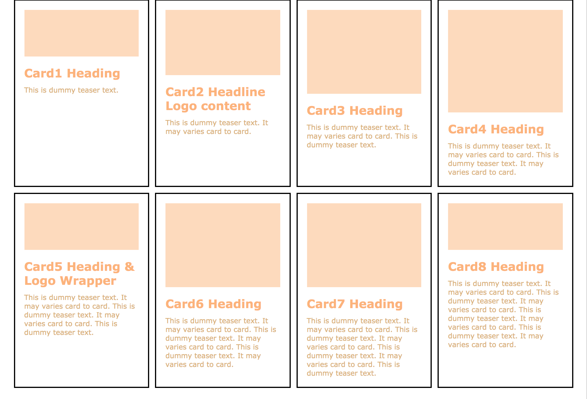
    <figcaption>&nbsp;&nbsp;&nbsp; Image - Demo Example: Card Layout </figcaption>
  </figure>
</p>

4.6. Grid Card Nested Layout
---------------------

> **Syntax & Example**: `4.6-demo-grid-card-nested-layout.html`

```html
<!DOCTYPE html>

<html lang="en">

  <head>
    <meta charset="UTF-8">
    <meta name="viewport" content="width=device-width, initial-scale=1.0">
    <meta http-equiv="X-UA-Compatible" content="ie=edge">
    <title>4.6-demo-grid-card-nested-layout.html</title>

    <style type="text/css">

      body {
        margin: 0;
        padding: 0;
        font-family: verdana;
      }

      .grid-layout-container {
        width: 960px;
        margin: 0 auto;
      }

      .main-container {
        display: grid;
        grid-template-columns: repeat(2, 1fr);
        grid-auto-rows: minmax(165px, auto);
        grid-gap: 10px;
      }

      .card {
        display: grid;
        grid-template-columns: repeat(1, 130px 1fr);
        /* grid-auto-rows: minmax(300px, auto); */
        grid-gap: 10px;

        color: #000000;
        font-size: 1rem;
        padding: 1rem;
        text-align: left;
        background-color: #fff;
        border: 1px solid #ddd;
        border-radius: 5px;

        -ms-box-shadow: 0 2px 2px rgba(0,0,0,.075);
        -moz-box-shadow: 0 2px 2px rgba(0,0,0,.075);
        -webkit-box-shadow: 0 2px 2px rgba(0,0,0,.075);
        box-shadow: 0 2px 2px rgba(0,0,0,.075);
      }

      .card .header{
        color:#428bca;
        font-size: 1.25em;
        margin-bottom: 0.5em;
        font-weight: bold;
      }

      .card .article{
        color:#666666;
        font-size: 0.75em;
      }

    </style>

  </head>

  <body>

    <div class="grid-layout-container">

      <h1>Enable CSS Grid Layout</h1>
      <p>CSS Grid Layout enabled different browser version:</p>

      <div class="main-container">
      
        <div class="card card1">
          <section class="logo-holder">
            
          </section>

          <section class="text-contaner">
            <header class="header">Chrome</header>
            <article class="article">
              Enabled by default since version 57
            </article>
          </section>

        </div>

        <div class="card card2">
          <section class="logo-holder">
            
          </section>

          <section class="text-contaner">
            <header class="header">Firefox</header>
            <article class="article">
              Enabled by default since version 52
            </article>
          </section>
          
        </div>

        <div class="card card3">
          <section class="logo-holder">
            
          </section>

          <section class="text-contaner">
            <header class="header">Internet-Explorer</header>
            <article class="article">
              Enabled by default since IE10 (old syntax)
            </article>
          </section>
          
        </div>

        <div class="card card4">
          <section class="logo-holder">
            
          </section>
          
          <section class="text-contaner">
            <header class="header">Opera</header>
            <article class="article">
              Enabled by default since version 44
            </article>
          </section>
          
        </div>

        <div class="card card5">
          <section class="logo-holder">
            
          </section>
          
          <section class="text-contaner">
            <header class="header">Safari</header>
            <article class="article">
              Enabled by default since version 10.1
            </article>
          </section>
          
        </div>

        <div class="card card6">
          <section class="logo-holder">
            
          </section>
          
          <section class="text-contaner">
            <header class="header">Epiphany</header>
            <article class="article">
              Enabled by default since version 3.24
            </article>
          </section>
          
        </div>

      </div>

  </div>
    
  </body>
  
</html>
```

<p>
  <figure>
    &nbsp;&nbsp;&nbsp; 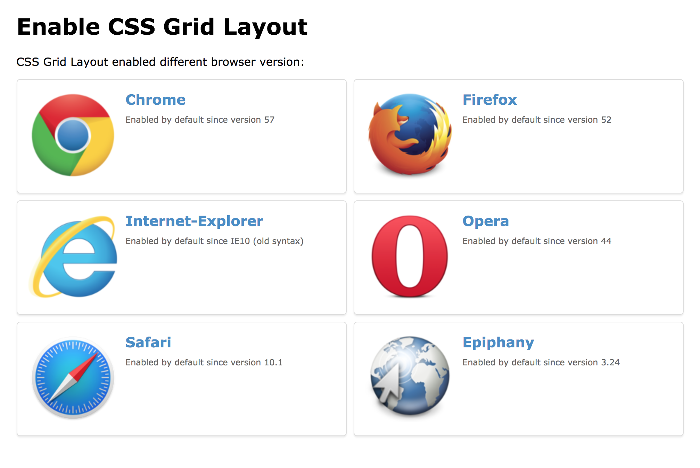
    <figcaption>&nbsp;&nbsp;&nbsp; Image - Demo Example: Card Nested Layout </figcaption>
  </figure>
</p>


5 CSS Grid Resources
=====================  

> **Reference:** - https://www.w3schools.com/css/css_grid.asp

> **Reference**: - https://developer.mozilla.org/en-US/docs/Web/CSS/CSS_Grid_Layout

> **Reference:** - https://css-tricks.com/snippets/css/complete-guide-grid/

> **Reference**: - https://tympanus.net/codrops/css_reference/grid/

> **Reference:** - https://gridbyexample.com/what/

> **Reference**: - https://learncssgrid.com/
